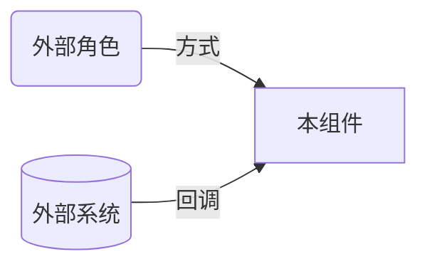

# <!-- 本组件名 --> 的入站·外部关系

<!--
本模板由 code-to-components skill 使用，放置于 specs/03-ARCH/L2/{组件名}/relation/inbound-external.md。
分类判定：运行时，外部角色（人）或外部系统主动连入本组件。外部角色（人）归此类（如用户访问、API 调用方请求、webhook 回调）。
只列本组件的直接入站关系；经其他组件中转的不列。无此类关系则不建此文件。
命名用 L1/context.md 中的实际外部实体名。删除所有 HTML 注释后再交付。
-->

### 外部角色

| 对方角色 | 方式 | 说明 |
| --- | --- | --- |
| <!-- 角色 --> | <!-- 浏览/调用 API 等 --> | <!-- 交互细节 --> |

### 外部系统

| 对方系统 | 方式 | 说明 |
| --- | --- | --- |
| <!-- 系统 --> | <!-- webhook 回调 等 --> | <!-- 交互细节 --> |
