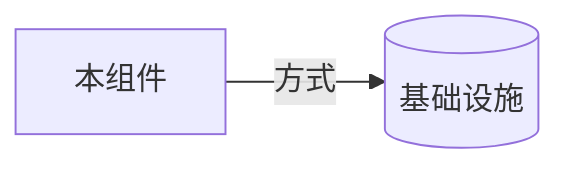

# <!-- 本组件名 --> 的基础设施依赖

<!--
本模板由 code-to-components skill 使用，放置于 specs/03-ARCH/L2/{组件名}/relation/infrastructure.md。
分类判定：本组件直接连接的支撑设施（数据库、缓存、消息队列、对象存储 等）。
与上游服务性质不同：基础设施是"系统如何落地"的内部决策，非对外业务关系。
只列本组件直接连接的设施；经其他组件中转的不列。无此类关系则不建此文件。
命名用实际设施名。删除所有 HTML 注释后再交付。
-->

| 基础设施 | 方向 | 方式 | 说明 |
| --- | --- | --- | --- |
| <!-- 设施 --> | <!-- 双向/读写 --> | <!-- SQL/RESP 等 --> | <!-- 交互细节 --> |
