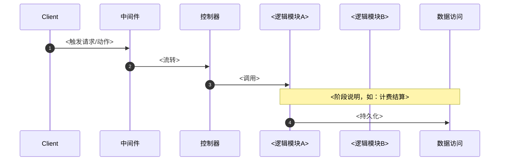

# <流程名，如：同步中继请求>

> <一句话场景说明：谁发起、什么触发（HTTP/后台定时/事件）、核心跨模块协作是什么>

## 时序图

<!--
Mermaid sequenceDiagram。要点：
- 参与方（participant）用**逻辑模块名**（编排入口、计费结算、渠道适配框架），不用目录名——体现 L3 级别。
- 外部角色/系统可用圆角（Client）或圆柱（上游 AI/支付网关）。
- 用 autonumber 给消息编号，便于与下方"流程说明"对应。
- 多阶段流程用 Note over ... 分隔阶段。
- 调用链必须据真实代码梳理（函数名/文件行号），不臆造。
-->

## 流程说明

<!--
按时间顺序逐步说明，每步对应时序图的消息/阶段。要点：
- 说清每步做什么、为什么流转到下一模块。
- 点出关键细节（如：预扣在 X 步、结算在 Y 步；幂等点在哪；事务边界在哪）。
- 据真实代码的函数名/文件行号写，不臆造。
-->

1. <步骤1>：<说明>
2. <步骤2>：<说明>

## 涉及的 L3 逻辑模块

<!--
列出本流程经过的所有逻辑模块，链接到 modules/ 下的模块卡（相对路径 ../modules/<域>/<模块>.md，因 flow 在 flows/ 下）。
形成"动态流程 ↔ 静态模块卡"双向呼应。
-->

| 阶段 | 逻辑模块 | 模块文件 |
| --- | --- | --- |
| <阶段> | <逻辑模块> | [../modules/<域>/<模块>.md](../modules/<域>/<模块>.md) |

## 项目约束（若有）

<!--
若该流程涉及 AGENTS.md 的硬约束（如计费安全、JSON 包装、跨库兼容），摘录适用部分。
无显著约束则删除本节。
-->
