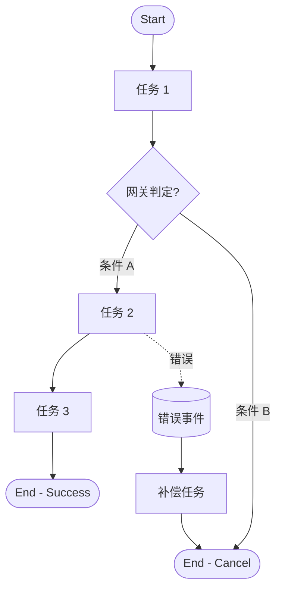

# [业务流程名称]

## 参与者

| 参与者 | 类型 | 职责 |
| --- | --- | --- | --- |
| [角色名] | 用户角色 | [一句话职责] |
| [系统名] | 系统 | [一句话职责] |
| ... | ... | ... |

## 流程图

```mermaid
flowchart TD
    START([Start]) --> T1[任务 1]
    T1 --> G1{网关判定?}
    G1 -- 条件 A --> T2[任务 2]
    G1 -- 条件 B --> END_FAIL([End - Cancel])
    T2 --> T3[任务 3]
    T3 --> END_OK([End - Success])

    %% 边界事件示例
    T2 -. 错误 .-> E1[(错误事件)]
    E1 --> COMP[补偿任务] --> END_FAIL
```

## 流程描述

[对流程图做文字说明]