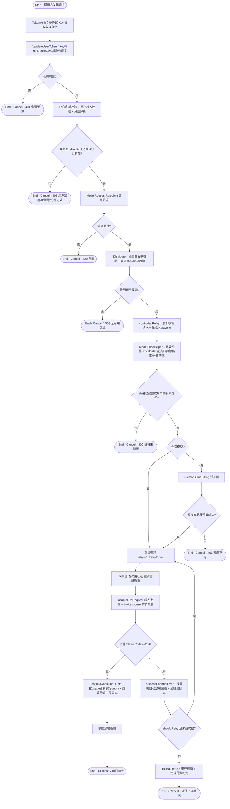

# 同步 AI 接口调用

## 参与者

| 参与者 | 类型 | 职责 |
| --- | --- | --- |
| 调用方 | 用户角色 | 持 API 令牌（或 Playground 会话）调用对话/补全/图像/音频/Embedding 等同步接口 |
| 网关接入层 | 系统 | TokenAuth 鉴权、限流、Distribute 分发渠道 |
| Relay 控制层 | 系统 | 请求解析、价格计算、预扣费、重试编排、计费结算 |
| 渠道适配器 | 系统 | 对接上游协议（OpenAI/Claude/Gemini 等），转换请求/响应 |
| 计费服务 | 系统 | 预扣费、结算差额、退款、额度预警 |
| 上游 AI 服务商 | 外部系统 | 实际处理 AI 请求并返回结果 |
| 缓存/数据库 | 外部系统 | Token/Channel 缓存、用户额度、消费日志 |

## 流程图

## 流程描述

这是 new-api 最核心的同步调用链路（`controller/relay.go:71` `Relay`），贯穿鉴权 → 分发 → 计费预扣 → 转发 → 结算的完整闭环。

**鉴权（TokenAuth，`middleware/auth.go:352`）**：多协议 Key 提取（支持 `Authorization: Bearer`、Anthropic `x-api-key`、Gemini `key=`、WebSocket `Sec-WebSocket-Protocol` 等），规范化后 `ValidateUserToken` 校验令牌状态/有效期/剩余额度，再做 IP 白名单、用户状态、分组解析（token 自身 group 覆盖用户 group 并校验可用性）。

**限流（ModelRequestRateLimit）**：按分组配置的 `totalMaxCount`/`successMaxCount` 做 Redis 滑动窗口或内存限流，仅在响应状态 <400 时记成功计数。

**分发（Distribute，`middleware/distributor.go:33`）**：校验令牌模型白名单，优先渠道亲和（`GetPreferredChannelByAffinity`），否则按分组/优先级/跨分组重试选渠道（`CacheGetRandomSatisfiedChannel`），选不到返回 503。

**Relay 主流程**：解析校验请求 → 计算价格（`ModelPriceHelper` 产出 `PriceData`，含预扣额度、模型倍率、分组倍率、是否免费）→ 非免费模型 `PreConsumeBilling` 预扣费（额度不足返回 403）→ 进入重试循环。每次重试取渠道、转发上游（`adaptor.DoRequest` + `DoResponse`）：
- **成功**：`PostTextConsumeQuota`（`service/text_quota.go:397`）按 `usage`（含 prompt/completion/cache/image/audio 分档）+ 各类倍率 + 阶梯计费计算实际 quota，与预扣做差额结算（`SettleBilling`，多退少补），写消费日志，触发额度预警。
- **失败**：`processChannelError` 按策略自动禁用故障渠道，`shouldRetry` 判定是否重试；用尽重试则 `Billing.Refund` 退还预扣，并判定是否需要违规罚费。

**Playground 特殊路径**：`/pg/*` 路由走 `UserAuth + Distribute`（不经 TokenAuth），用 Session 免创建 API 令牌，构造临时 token（`tokenId=0`）后复用 `Relay`；`IsPlayground=true` 时计费跳过令牌额度，仅对用户钱包/订阅计费。

信任旁路机制（`shouldTrust`）：当 `TrustQuota>0` 且额度充足时，预扣实际不扣（`effectiveQuota=0`），仅记录信任，结算时一次性按实际 quota 处理，降低高频小额度请求的扣费开销；异步任务（`ForcePreConsume`）强制旁路失效。
