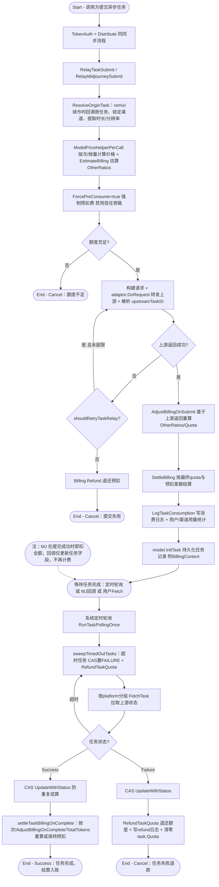

# 异步任务型 AI 接口调用

## 参与者

| 参与者 | 类型 | 职责 |
| --- | --- | --- |
| 调用方 | 用户角色 | 提交 Midjourney/Suno/Video 等异步任务并查询结果 |
| 网关接入层 | 系统 | TokenAuth 鉴权、Distribute 分发 |
| Relay 任务层 | 系统 | 任务提交、预扣费、上游转发、计费调整、任务持久化 |
| 任务调度器 | 系统 | 系统定时任务轮询 Suno/Video 任务状态、超时清理 |
| 上游任务平台 | 外部系统 | MidjourneyProxy/Suno/视频厂商处理任务 |
| 计费服务 | 系统 | 提交结算、完成时重算、失败退款 |
| 数据库 | 外部系统 | 持久化 task / midjourney 记录与 BillingContext |

## 流程图

## 流程描述

异步任务型接口（Midjourney/Suno/Video 等）与同步调用的核心差异在于：**任务有生命周期，计费跨越提交、完成、失败多个时点**。

**任务提交**（`relay/relay_task.go:145` `RelayTaskSubmit`；MJ 走 `mjproxy_handler.go:393`）：鉴权分发同同步流程。提交时先 `ResolveOriginTask`（remix/续作回溯原任务并锁定渠道），按次/按量计算价格并估算 OtherRatios（时长/分辨率），**强制预扣费**（`ForcePreConsume=true`，禁用信任旁路）。转发上游拿到 `upstreamTaskID` 后，`AdjustBillingOnSubmit` 基于上游返回重算 Quota，与预扣差额结算，写消费日志，持久化任务记录（附带 `BillingContext` 供后续轮询结算）。提交失败按 `shouldRetryTaskRelay`（429/307/5xx 重试；400/408 不重试）重试，全失败则退款。

**MJ 特殊性**：MJ 在提交成功时即扣全额（`PostConsumeQuota`，预扣=0），回调（`RelayMidjourneyNotify`）仅更新任务字段，不再计费。

**状态查询**有三条路径：
1. **系统定时轮询**（`service/task_polling.go:108`，由 system_task 调度）：先 `sweepTimedOutTasks`（超时任务 CAS 置 FAILURE 并退款），再按 platform 分组并发 `FetchTask` 拉上游状态。
2. **MJ 回调**：更新 MJ 任务字段。
3. **用户主动 Fetch**（`RelayTaskFetch`）：从本地读或实时拉上游。

**结算与退款**（轮询路径，`task_polling.go:441` `updateVideoSingleTask`）：用 **CAS（`UpdateWithStatus(prevStatus)`）** 防止并发重复结算。成功时 `settleTaskBillingOnComplete` 按优先级重算（按次跳过 → `AdjustBillingOnComplete` 正数 → `TotalTokens` 按量 → 保持预扣）；失败时 `RefundTaskQuota` 退还额度、写 refund 日志、清零 `task.Quota`。所有异步调整带 CAS，保证幂等。

遗留系统任务（无 BillingContext）不退款，作为兼容处理。
