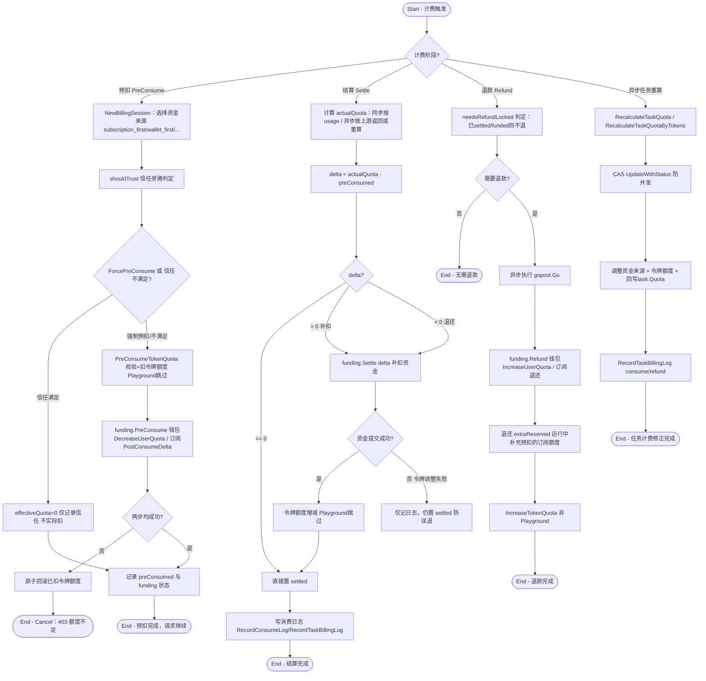

# 计费结算闭环

## 参与者

| 参与者 | 类型 | 职责 |
| --- | --- | --- |
| 计费服务（BillingSession） | 系统 | 统一抽象预扣/结算/退款，对接资金来源与令牌额度 |
| 资金来源（Funding） | 系统 | WalletFunding（钱包）/ SubscriptionFunding（订阅），提供额度供给 |
| 令牌额度 | 系统 | token 级别的额度限制（独立于用户钱包） |
| 数据库 | 外部系统 | 持久化 user.quota、token.remain_quota、subscription、消费/退款日志 |

## 流程图

## 流程描述

计费结算是 new-api 的资金中枢，由 `BillingSession`（`service/billing_session.go`）统一抽象，实现 `relaycommon.BillingSettler` 接口。资金来源分两类：`WalletFunding`（用户钱包）与 `SubscriptionFunding`（订阅额度），按 `BillingPreference`（`subscription_first` 默认 / `wallet_first` / `subscription_only` / `wallet_only`）选择与回退。

**预扣（PreConsume，`billing_session.go:186`）**：先判定信任旁路（`shouldTrust`）——`ForcePreConsume=true`（异步任务）强制预扣；`TrustQuota>0` 且额度充足时 `effectiveQuota=0` 不实际扣（降低高频小额度开销），但订阅资金来源不允许旁路。实际预扣分两步：先扣令牌额度（`PreConsumeTokenQuota`，Playground 跳过），再扣资金来源（钱包 `DecreaseUserQuota` 或订阅 `PostConsumeUserSubscriptionDelta`），任一失败原子回滚。工厂层预先校验 `userQuota - preConsumed >= 0`，不足直接 403。

**结算（Settle，`billing_session.go:41` + `service/billing.go:51`）**：`delta = actualQuota - preConsumed`，delta=0 直接 settled；非零则两阶段提交——先 `funding.Settle(delta)`（成功置 `fundingSettled`），再调整令牌额度。若资金已提交但令牌调整失败，仅记日志仍置 settled，防止误退。结算后写消费日志（含 prompt/completion tokens、quota、各类倍率、阶梯信息、`admin_info`），触发额度预警。

**退款（Refund，`billing_session.go:82`）**：触发于同步请求最终失败（defer 兜底）或异步提交全失败。互斥锁 + `needsRefundLocked` 判定（已 settled/funded 不退），异步执行：资金来源退款、退还 `extraReserved`、退还令牌额度（非 Playground）。

**异步任务补偿（`service/task_billing.go`）**：`RecalculateTaskQuota`（通用差额结算）、`RecalculateTaskQuotaByTokens`（按实际 token 重算）、`RefundTaskQuota`（失败退款），全部带 CAS（`task.UpdateWithStatus`）防并发重复，回写 `task.Quota` 并写 consume/refund 日志。

**安全不变量**：所有 quota 转换走 `common/quota_math.go`（`QuotaFromFloat`/`QuotaRound`/`QuotaFromDecimal`），饱和到 int32 防溢出，饱和事件经 `*Checked` 变体捕获到 `relayInfo.QuotaClamp` 并审计到日志 `admin_info.quota_saturation`，保证永不产生负扣费（详见 `pkg/billingexpr/expr.md`）。
