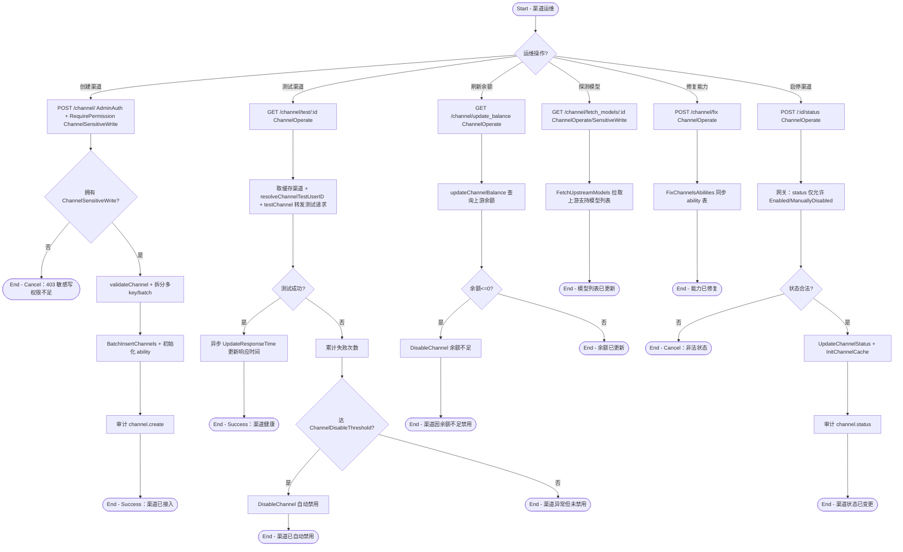

# 渠道接入与运维

## 参与者

| 参与者 | 类型 | 职责 |
| --- | --- | --- |
| 管理员 | 用户角色 | 测试渠道、刷新余额、探测模型、启停渠道、修复能力 |
| 超管 | 用户角色 | 创建/编辑/删除渠道（敏感写权限）、查看密钥（见系统治理分组） |
| 上游 AI 服务商 | 外部系统 | 提供渠道测试、余额查询、模型列表 |
| 网关接入层 | 系统 | AdminAuth + RequirePermission RBAC 双层鉴权、自动禁用 |
| 数据库/缓存 | 外部系统 | channel / ability 表、渠道缓存 |

## 流程图

## 流程描述

渠道是连接网关与上游 AI 服务商的桥梁，其运维贯穿接入、健康检查、能力维护、流量调度。

**鉴权模型**（双层）：组级 `AdminAuth`（角色 ≥ 管理员）之上叠加 `RequirePermission`（Casbin RBAC）。渠道资源有 5 个 action（`service/authz/resources_channel.go:14-19`）：Read/Operate/Write 管理员默认拥有；**SensitiveWrite（创建/改密钥/删除）与 SecretView 默认不授予**，需超管显式授权。`UpdateChannel` 内部还有运行时升级校验 `channelHasSensitiveChanges`——检测到敏感字段变更且无 SensitiveWrite 权限时 403（`controller/channel.go:995`），fail-closed（未知字段视为敏感）。

**创建渠道**（`controller/channel.go:612`）：需 SensitiveWrite 权限，校验 key/模型名/Vertex 地区后拆分多 key 批量入库并初始化 ability。

**测试渠道**（`controller/channel-test.go:828`）：转发测试请求，成功更新响应时间，失败累计达阈值（`ChannelDisableThreshold`）自动 `DisableChannel`。批量测试（`TestAllChannels`）循环执行。

**刷新余额**（`controller/channel-billing.go:424`）：查询上游余额，余额 ≤0 自动禁用。

**探测模型/修复能力**：`FetchUpstreamModels` 拉上游模型列表保持配置一致；`FixChannelsAbilities` 同步 ability 表。

**启停渠道**（`channel.go:1127`）：仅允许 `Enabled`/`ManuallyDisabled` 间切换，更新后重初始化渠道缓存，支持按标签批量启停以灵活调度流量。

自动禁用（`service.DisableChannel`）由测试/余额流程触发，配合自动测试/余额定时器（`AutomaticallyUpdateChannels`）形成渠道健康自愈闭环。
