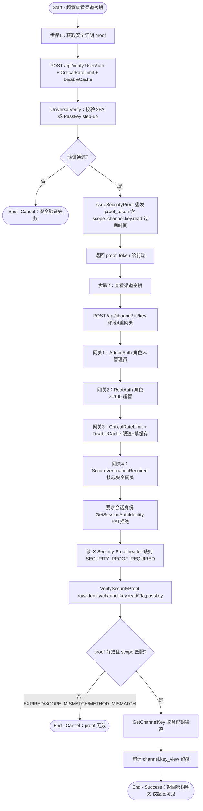

# 渠道密钥查看

## 参与者

| 参与者 | 类型 | 职责 |
| --- | --- | --- |
| 超管 | 用户角色 | 查看渠道上游密钥明文（最高敏感操作） |
| WebAuthn/TOTP 认证器 | 外部系统 | 提供安全验证 proof（2FA 或 Passkey step-up） |
| 网关接入层 | 系统 | 4 重独立网关保护 |
| 数据库/审计 | 外部系统 | 持久化渠道密钥、审计 channel.key_view |

## 流程图

## 流程描述

渠道密钥查看是平台最高敏感操作，采用"先获取安全证明，再凭证明查看"的两步流程，并穿过 **4 重独立网关**保护（`router/channel-router.go:23-29`）。

**步骤 1 - 获取安全证明**（`POST /api/verify`，`controller/secure_verification.go:27` `UniversalVerify`）：超管先完成 2FA（TOTP）或 Passkey 的 step-up 验证（Passkey 走独立 begin/finish 流），通过后 `IssueSecurityProof` 签发一个带 scope（如 `channel.key.read`）和过期时间的 `proof_token`。scope 受白名单 `isAllowedSecurityProofScope` 限制。

**步骤 2 - 查看渠道密钥**（`POST /api/channel/:id/key`）依次穿过：
1. **AdminAuth**：先要 admin 角色。
2. **RootAuth**：升级到超管（`role>=100`）。
3. **CriticalRateLimit + DisableCache**：限速并禁用响应缓存，防止密钥被中间层缓存。
4. **SecureVerificationRequired**（核心，`middleware/secure_verification.go:14`）：要求**会话身份**（PAT 被拒），读取 `X-Security-Proof` header，调 `VerifySecurityProof` 校验 proof 的有效性、scope 匹配、method 匹配，失败按 EXPIRED/SCOPE_MISMATCH/METHOD_MISMATCH 分别报错。

全部通过后 `GetChannelKey`（`controller/channel.go:421`）取含密钥渠道，并写 `channel.key_view` 审计留痕。

> 注：`ChannelSecretView` 这个 RBAC 权限位是"Reserved"（`resources_channel.go:50-53`），目前密钥查看的实际网关是 RootAuth + SecureVerification，而非 RBAC，构成设计上的双重门。
