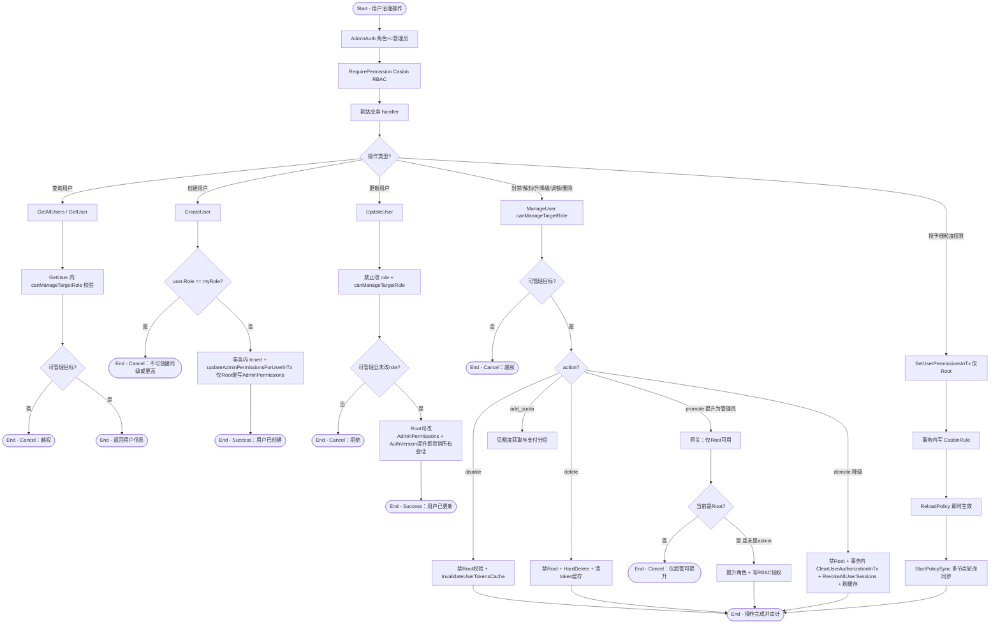

# 用户与权限治理

## 参与者

| 参与者 | 类型 | 职责 |
| --- | --- | --- |
| 管理员 | 用户角色 | 管理普通用户：查/建/封/解/降级/调额/删/清绑定 |
| 超管 | 用户角色 | 任免管理员、授予细粒度 RBAC 权限、提升用户为管理员 |
| 普通用户 | 用户角色 | 被治理对象 |
| RBAC 引擎（Casbin） | 系统 | 细粒度权限判定（sub/obj/act/eft，some(allow)） |
| 网关接入层 | 系统 | AdminAuth + RequirePermission + canManageTargetRole 三层校验 |

## 流程图

## 流程描述

用户与权限治理是平台运营的核心，由三层鉴权保护：粗粒度 `AdminAuth`（角色 ≥ 管理员）→ 细粒度 `RequirePermission`（Casbin RBAC）→ 业务内 `canManageTargetRole`（`myRole==Root || myRole>targetRole`，`controller/user.go:371`）。

**RBAC 权限模型**（`service/authz/`）：Casbin `sub,obj,act,eft`，effect `some(allow)`。角色映射：Root→`role:root`（Superuser 短路全 allow），Admin→`role:admin`。判定优先级（`resolver.go:8` `Can`）：Superuser 全允许 → 个人 override（`UserSubject`）> 角色 baseline。任免与授权写入（`SetUserPermissionsInTx`）仅 Root 可触发，`ReloadPolicy` 后生效，多节点由 `StartPolicySync` 轮询同步。

**角色层级网关** `canManageTargetRole` 贯穿所有针对单个用户的写操作（`GetUser`/`UpdateUser`/`ManageUser`/`DeleteUser`/`AdminClearUserBinding`/`AdminDisable2FA`/`AdminResetPasskey`），防止同级或越级操作。

**关键约束**：
- 创建用户时 `user.Role >= myRole` 拒绝（不可创建同级或更高）。
- 更新用户禁止改 role；Root 可改 AdminPermissions；AuthVersion 提升即吊销所有会话。
- `ManageUser` 综合动作（`controller/user.go:1092`）：disable（禁 Root）、delete（禁 Root + 硬删）、**promote（仅 Root）**、demote（禁 Root + 事务清 RBAC 授权 + 吊销会话 + 刷缓存）、add_quota（见额度获取与支付分组）。

**降级联动**：demote 在事务内 `ClearUserAuthorizationInTx` + `RevokeAllUserSessions("admin_demote")` + `InvalidateUserTokensCache`，保证权限即时收敛。所有写操作自动留审计日志。
