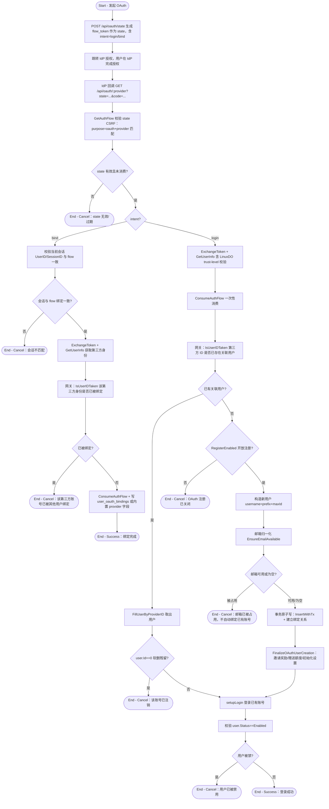

# OAuth 登录与账号绑定

## 参与者

| 参与者 | 类型 | 职责 |
| --- | --- | --- |
| 访客/用户 | 用户角色 | 通过第三方身份提供商登录或为已有账号绑定第三方身份 |
| OAuth IdP | 外部系统 | GitHub/Discord/OIDC/LinuxDO/自定义/微信/Telegram 提供身份凭证 |
| 网关接入层 | 系统 | state CSRF 校验、会话绑定校验、重复绑定校验、注册开关判定 |
| 关系数据库 | 外部系统 | 持久化 user_oauth_bindings、外部身份占位、auth_flow |

## 流程图

## 流程描述

本流程统一处理标准 OAuth（GitHub/Discord/OIDC/LinuxDO/自定义）的登录与绑定（`controller/oauth.go`）。微信与 Telegram 走独立的非标 OAuth 路由，逻辑类似但绑定写入字段不同。

**state 生成**（`oauth.go:38`）创建一个 10 分钟有效的 `AuthFlow`（purpose=oauth，含 provider、intent、可选 UserId/SessionId、邀请码），返回 `flow_token` 作为 OAuth `state` 参数，承担 CSRF 防护。

**回调处理**（`oauth.go:95` `HandleOAuth`）先校验 state 有效性与 provider 匹配，再按 intent 分流：
- **绑定（bind）**：要求当前登录会话与 flow 绑定一致，获取第三方身份后校验该身份未被其他用户占用，通过后写绑定关系（自定义 provider 写 `user_oauth_bindings` 表，内置 provider 写对应 `github_id` 等字段）。
- **登录（login）**：获取第三方身份（LinuxDO 额外校验 trust-level），消费 flow，判定该第三方 ID 是否已关联用户：
  - **已关联** → 取出该用户登录（软删残留视为已注销）。
  - **未关联** → 判定 `RegisterEnabled`：关闭则拒绝；开放则创建新用户，邮箱被占用时拒绝自动绑定（`OAuthEmailAlreadyTakenError`），事务内原子创建用户与绑定关系，完成后发放邀请/注册奖励。

无论登录还是新建，最终都汇聚到 `setupLogin` 签发会话，并校验用户未被禁用。
