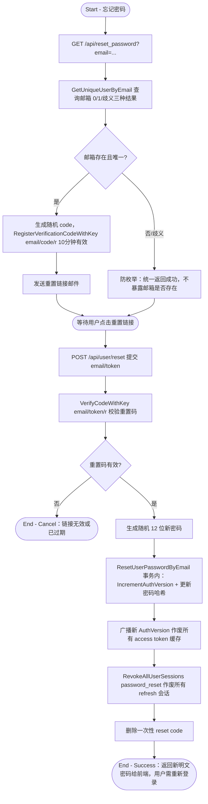

# 密码找回

## 参与者

| 参与者 | 类型 | 职责 |
| --- | --- | --- |
| 访客 | 用户角色 | 通过邮箱重置密码重新获得账号访问权 |
| 网关接入层 | 系统 | 验证码校验、防枚举处理、密码重置 |
| 邮箱服务 | 外部系统 | 发送重置链接邮件 |
| 会话存储 | 系统 | 作废旧会话（重置后所有登录失效） |

## 流程图

## 流程描述

密码找回通过邮箱完成（`controller/misc.go:302`）。访客提交邮箱后，系统查询该邮箱（`GetUniqueUserByEmail` 处理 0/1/歧义三种情况）。为防邮箱枚举攻击，**无论邮箱是否存在或存在歧义，都统一返回成功**；只有邮箱存在且唯一时才真正生成 10 分钟有效的重置码并发送重置链接邮件。

访客点击邮件中的重置链接后提交 email 与 token（`misc.go:335` `ResetPassword`），系统校验重置码有效性，通过后生成随机 12 位新密码，在事务内重置密码（`ResetUserPasswordByEmail`）。重置会触发关键的补偿动作：递增 `AuthVersion`（作废所有 access token 缓存）并 `RevokeAllUserSessions`（使所有现有 refresh 会话失效），确保即使旧密码已泄露，攻击者持有的会话也会被立即踢出。最后删除一次性 reset code 并返回新明文密码，用户需用新密码重新登录。
