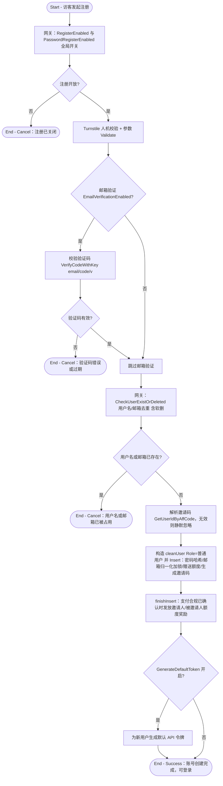

# 用户注册

## 参与者

| 参与者 | 类型 | 职责 |
| --- | --- | --- |
| 访客 | 用户角色 | 提交用户名/密码（可选邮箱+验证码、邀请码）创建账号 |
| 网关接入层 | 系统 | 全局开关校验、Turnstile 人机校验、CriticalRateLimit 限流 |
| 邮箱服务 | 外部系统 | 接收并下发注册验证码（开启邮箱验证时） |
| 关系数据库 | 外部系统 | 持久化用户、验证码、邀请关系 |

## 流程图

## 流程描述

访客注册需先穿过全局开关网关（`RegisterEnabled` + `PasswordRegisterEnabled`，`controller/user.go:207`）与 Turnstile 人机校验。若站点开启邮箱验证（`EmailVerificationEnabled`），访客需先获取并校验邮箱验证码（`common/verification.go:47`，10 分钟有效）。

随后系统进行用户名与邮箱去重（含软删除残留检测，`model/user.go:240` `CheckUserExistOrDeleted`）。通过后解析邀请码（无效邀请码静默忽略，不阻断注册），在事务内创建用户：密码哈希、邮箱归一化加锁（防并发重复）、发放新用户额度、生成专属邀请码（`model/user.go:591` `Insert`）。注册完成后，若支付合规已确认（`IsPaymentComplianceConfirmed`），向邀请人累计邀请奖励（`AffQuota`）并向被邀请人发放额度（`model/user.go:617` `finishInsert`）。可选地，开启 `GenerateDefaultToken` 时为新用户预置一个 API 令牌。
