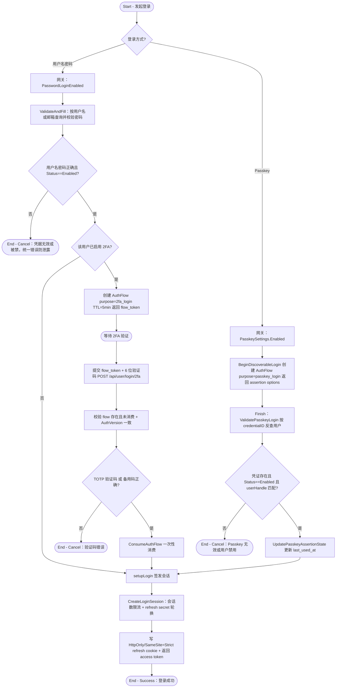

# 用户登录

## 参与者

| 参与者 | 类型 | 职责 |
| --- | --- | --- |
| 访客/用户 | 用户角色 | 通过密码、密码+2FA、或 Passkey 完成登录获取会话 |
| 网关接入层 | 系统 | 全局开关、密码校验、2FA 分流、Passkey 校验 |
| TOTP 认证器 | 外部系统 | 提供 2FA 动态验证码（Google Authenticator 等） |
| WebAuthn 认证器 | 外部系统 | Passkey 通行密钥（设备指纹/YubiKey/平台认证器） |
| 会话存储 | 系统 | 签发并持久化 user_session，承载 refresh token 与 auth version |

## 流程图

## 流程描述

本流程支持三种登录方式，最终都汇聚到统一的会话签发逻辑 `setupLogin`。

**密码登录**（`controller/user.go:40`）先校验 `PasswordLoginEnabled`，再通过 `ValidateAndFill` 按用户名或邮箱查询并校验密码与用户状态，失败时统一返回"凭据无效"以防信息泄露。若用户启用了 2FA（`IsTwoFAEnabled`），不直接签发会话，而是创建一个 5 分钟有效的 `AuthFlow`（purpose=2fa_login，绑定当前 `AuthVersion`），返回 `flow_token` 让前端进入 2FA 验证步骤（`controller/twofa.go:427` `Verify2FALogin`）。验证时需校验 flow 未消费、`AuthVersion` 与登录时一致（防止密码改后旧 flow 复用），再校验 TOTP 验证码或备用码，通过后一次性消费 flow 并签发会话。

**Passkey 登录**（`controller/passkey.go:296`）需站点开启 Passkey，经 `BeginDiscoverableLogin` 创建 `AuthFlow`（purpose=passkey_login）持久化 WebAuthn sessionData，Finish 时按 `credentialID` 反查用户并校验状态与 userHandle，通过后更新凭证使用时间并签发会话。

会话签发（`service/auth_session.go:45` `CreateLoginSession`）包含会话数限流与 refresh secret 轮换，最终写入 HttpOnly、SameSite=Strict 的 refresh cookie 并返回 access token。
