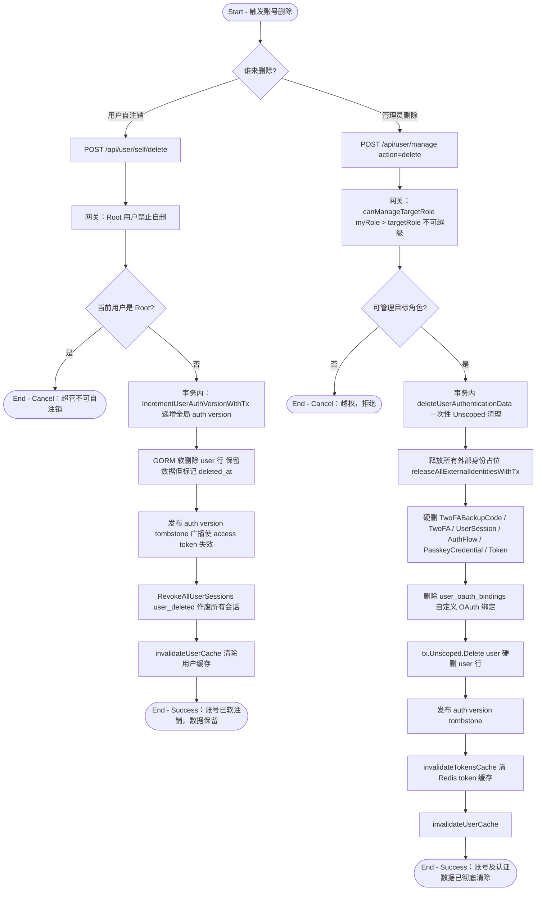

# 账号注销与删除

## 参与者

| 参与者 | 类型 | 职责 |
| --- | --- | --- |
| 普通用户 | 用户角色 | 主动注销自己的账号 |
| 管理员 | 用户角色 | 删除违规或废弃的用户账号（硬删除） |
| 网关接入层 | 系统 | 角色层级校验、数据清理、缓存与凭证作废 |
| 关系数据库 | 外部系统 | 软删除/硬删除用户及关联认证数据 |

## 流程图

## 流程描述

账号删除分两类，数据清理粒度不同。

**用户自注销**（`controller/user.go:989` `DeleteSelf` → `model/user.go:853` `Delete`）是软删除：先校验 Root 用户不可自删（避免站点无主），事务内递增 `AuthVersion`（使所有 access token 失效），GORM 软删除用户行（保留数据），事务后广播 auth version、作废所有会话、清除缓存。软删后用户名/邮箱仍占用，防止重复注册与去重冲突。

**管理员硬删除**（`controller/user.go:957` `DeleteUser` → `model/user.go:877` `HardDelete`）需先通过角色层级网关 `canManageTargetRole`（`myRole > targetRole`，Root 除外）。通过后在事务内 `deleteUserAuthenticationData`（`user.go:914`）一次性 `Unscoped` 清理所有认证相关数据：释放外部身份占位、硬删 2FA/备用码/会话/AuthFlow/Passkey/Token/OAuth 绑定、最后硬删 user 行。事务后发布 tombstone 与清缓存。彻底删除后该用户名/邮箱可被重新注册。

**横切补偿**：任何改变用户安全态的操作（改密码、启禁 2FA、注册/删除 Passkey）都会触发 `IncrementUserAuthVersion` + `RevokeAllUserSessions`（或 `AdvanceCurrentSessionToUserVersion` 仅保留当前会话），这是贯穿账号生命周期各子流程的统一安全补偿动作。
