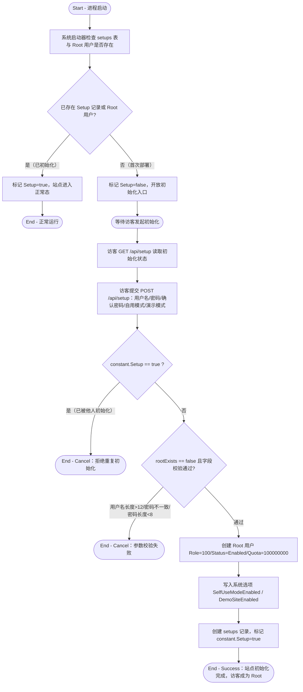

# 首次部署初始化

## 参与者

| 参与者 | 类型 | 职责 |
| --- | --- | --- |
| 访客 | 用户角色 | 在站点首次部署时提交 Root 账号信息，接管站点 |
| 系统启动器 | 系统 | 进程启动时检测 `setups` 表与是否存在 Root 用户，决定是否处于初始化态 |
| 关系数据库 | 外部系统 | 持久化 `setups` 记录、Root 用户、系统选项（Option） |

## 流程图

## 流程描述

本流程是站点从"空白部署"到"可被管理"的引导流程。进程启动时由系统启动器检查 `setups` 表与 Root 用户是否已存在（`model/main.go:80` `CheckSetup`）：若存在则标记 `constant.Setup=true` 进入正常运行；否则保持 `Setup=false`，开放 `GET/POST /api/setup` 供访客完成接管。

访客提交初始化请求后，系统先做"是否已被初始化"网关判定（`controller/setup.go:46`），再做字段校验（用户名 ≤12 位、密码一致、密码 ≥8 位），通过后创建唯一的 Root 超级管理员账号（`controller/setup.go:105`），写入自用/演示模式选项，并落库 `Setup` 记录使站点转入正常态。重复初始化或字段不合规均直接取消，不产生副作用。
