# 兑换码兑换

## 参与者

| 参与者 | 类型 | 职责 |
| --- | --- | --- |
| 管理员 | 用户角色 | 生成兑换码并向用户发放 |
| 普通用户 | 用户角色 | 输入兑换码换取额度 |
| 网关接入层 | 系统 | 支付合规前置、并发锁、行锁与 CAS、防枚举 |
| 关系数据库 | 外部系统 | 持久化 redemption、user.quota、日志 |

## 流程图

```mermaid
flowchart TD
    %% 生成兑换码（管理员）
    subgraph GEN [管理员生成兑换码]
        G_START([管理员发起生成]) --> G1[POST /api/redemption]
        G1 --> G2[网关：IsPaymentComplianceConfirmed 支付合规已确认]
        G2 --> G_GC{合规已确认?}
        G_GC -- 否 --> G_FAIL([End - Cancel：未确认支付合规])
        G_GC -- 是 --> G3[校验 name 长度1-20 / count 1-100 / 过期时间]
        G3 --> G4{参数合法?}
        G4 -- 否 --> G_FAIL2([End - Cancel：参数校验失败])
        G4 -- 是 --> G5[循环 count 次 GetUUID 生成32位key]
        G5 --> G6[Redemption.Insert 批量入库 status=Enabled]
        G6 --> G7[审计 redemption.create]
        G7 --> G_END([End - Success：兑换码已生成])
    end

    %% 用户兑换
    subgraph REDEEM [用户兑换]
        R_START([用户发起兑换]) --> R1[POST /api/user/topup key=...]
        R1 --> R2[网关：IsPaymentComplianceConfirmed]
        R2 --> R_PC{合规已确认?}
        R_PC -- 否 --> R_FAIL([End - Cancel：兑换不可用])
        R_PC -- 是 --> R3[用户级 tryLock 防并发兑换]
        R3 --> R4[model.Redeem 单事务]
        R4 --> R5[lockForUpdate 行锁查兑换码]
        R5 --> R_G1{兑换码存在?}
        R_G1 -- 否 --> R_FAIL2([End - Cancel：兑换失败，统一错误防枚举])
        R_G1 -- 是 --> R_G2{status==Enabled?}
        R_G2 -- 否 --> R_FAIL2
        R_G2 -- 是 --> R_G3{未过期?}
        R_G3 -- 否 --> R_FAIL2
        R_G3 -- 是 --> R6[CAS UPDATE WHERE id AND status=Enabled SET status=Used]
        R6 --> R_G4{RowsAffected==1?}
        R_G4 -- 否 并发竞争 --> R_FAIL2
        R_G4 -- 是 --> R7[user.quota += redemption.quota]
        R7 --> R8[RecordLog LogTypeTopup]
        R8 --> R_END([End - Success：额度已到账])
    end
```

## 流程描述

兑换码是额度获取的最简单形式，分生成与兑换两端。

**生成**（`controller/redemption.go:64` `AddRedemption`）必须以支付合规确认为前置（未确认则拒绝），校验名称/数量/过期时间后，循环调用 `GetUUID` 生成 32 位 key 并批量入库（`status=Enabled`），全程留审计。

**兑换**（`controller/user.go:1362` `TopUp` → `model/redemption.go:137` `Redeem`）同样以支付合规为前置，并加用户级锁防并发。核心在一个数据库事务内完成：`lockForUpdate` 行锁查询兑换码，依次校验存在性、状态（`Enabled`）、有效期，通过后用 **CAS（`WHERE id=? AND status=Enabled`）** 原子翻转状态为 `Used`——若 `RowsAffected==0` 说明被并发竞争，视为失败。CAS 成功后同事务增加用户额度并记录充值日志。

所有失败对外统一返回 `MsgRedeemFailed`（`user.go:1383`），不暴露"不存在/已用/过期"等细分原因，防止枚举攻击探测有效兑换码。
