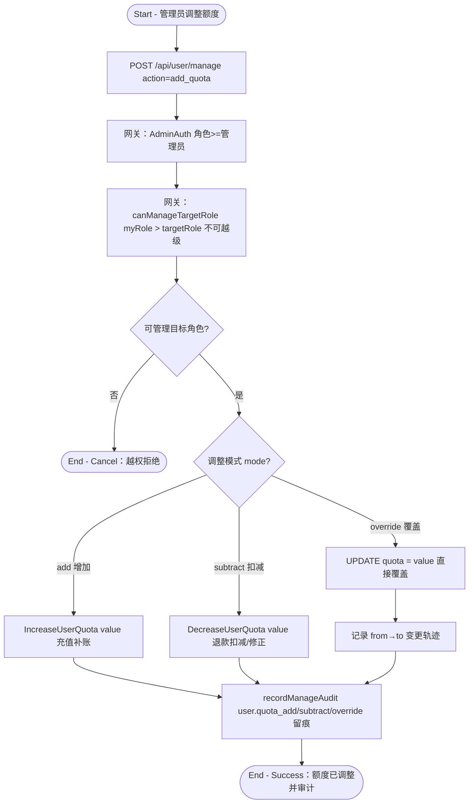

# 管理员额度调整

## 参与者

| 参与者 | 类型 | 职责 |
| --- | --- | --- |
| 管理员 | 用户角色 | 为用户充值补账、退款扣减、修正异常额度 |
| 普通用户 | 用户角色 | 被调整额度的对象 |
| 网关接入层 | 系统 | 角色层级校验、审计留痕 |
| 关系数据库 | 外部系统 | 持久化 user.quota、审计日志 |

## 流程图

## 流程描述

管理员人工调整用户额度（`controller/user.go:1092` `ManageUser`，`action=add_quota` 分支 `user.go:1170`）用于充值补账、退款扣减、修正异常等运营场景。

前置网关有两层：粗粒度 `AdminAuth`（角色 ≥ 管理员）与业务内角色层级校验 `canManageTargetRole`（`myRole > targetRole`，Root 除外），防止同级或越级操作。

支持三种调整模式：
- **add（增加）**：`IncreaseUserQuota`，用于充值补账。
- **subtract（扣减）**：`DecreaseUserQuota`，用于退款或修正多扣。
- **override（覆盖）**：直接 `UPDATE quota = value`，记录 from→to 变更轨迹，用于异常修正。

每种模式均通过 `recordManageAudit` 写审计日志（`user.quota_add`/`user.quota_subtract`/`user.quota_override`），确保所有人工额度变动可追溯。
