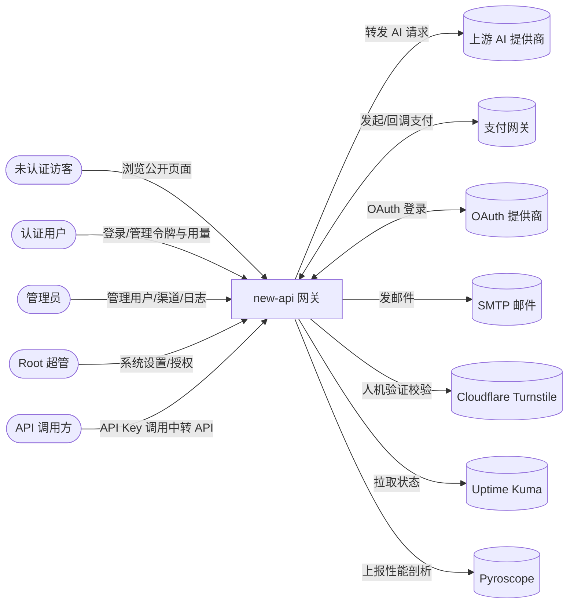

# 系统上下文

## 系统职责

AI API 网关与代理服务：聚合 40+ 上游 AI 提供商，对外提供统一 HTTP API、用户管理、计费、限流和管理后台。

## 系统上下文图

## 外部角色

| 角色 | 说明 |
| --- | --- |
| 未认证访客 | 访问公开页面与接口（定价、公告、系统状态、注册/登录入口），无需登录 |
| 认证用户 | 登录用户，管理自己的 API 令牌、用量日志、订阅、配额与钱包 |
| 管理员 | 管理用户、渠道分组、兑换码，查看全局日志 |
| Root 超管 | 系统设置、自定义 OAuth、性能、倍率同步、系统任务与信息 |
| API 调用方 | 持 API Key（`sk-xxx`）调用 AI 中转 API的客户端；与上述用户角色体系正交，普通用户与管理员均可持令牌调用 |

## 外部系统

### 上游服务

| 系统 | 类别 | 与本系统的关系 |
| --- | --- | --- |
| 上游 AI 提供商（OpenAI、Anthropic Claude、Google Gemini/Vertex/PaLM、AWS Bedrock、阿里、百度、智谱、讯飞、腾讯、月之暗面、DeepSeek、MiniMax、豆包、xAI、Cohere、Mistral、Perplexity、Replicate、OpenRouter、Coze、Dify、Jina、SiliconFlow、Ollama、xinference、Cloudflare AI、lingyiwanwu、mokaai、即梦 等 40+ 家） | 上游服务 | 本系统作为 AI 网关，按渠道配置向其转发对话/嵌入/图像/音频/异步任务请求并聚合响应；按渠道动态配置，全部可选 |
| 支付网关（Stripe、EPay 易支付、Creem、Waffo / Waffo Pancake） | 上游服务 | 本系统发起充值/订阅支付订单，并接收其异步 webhook 回调确认支付；按需启用，全部可选 |
| OAuth 提供商（GitHub、Discord、LinuxDo、OIDC、微信、Telegram、任意自定义 OAuth2） | 上游服务 | 本系统作为 OAuth 客户端完成第三方登录与账号绑定；按需启用，全部可选 |
| OpenAI Codex OAuth（auth.openai.com） | 上游服务 | 本系统通过 OAuth 刷新 Codex 凭证以支撑 Codex 风格中转；可选 |
| SMTP 邮件服务 | 上游服务 | 本系统通过 SMTP/SSL/STARTTLS（含 NTLM/Outlook 鉴权）发送验证与通知邮件；可选 |
| Cloudflare Turnstile | 上游服务 | 登录/注册等敏感接口的人机验证校验；可选 |
| Uptime Kuma | 上游服务 | 本系统拉取其状态页数据在仪表盘展示；可选 |
| Grafana Pyroscope | 上游服务 | 本系统上报 CPU/内存/Mutex/Block 持续性能剖析；可选 |
