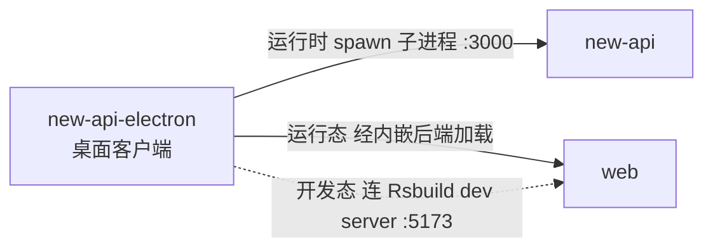
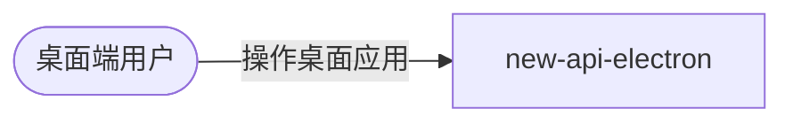

# new-api-electron 的组件关系

## 与其他组件的关系

| 对方组件 | 时机 | 方向 | 方式 | 说明 |
| --- | --- | --- | --- | --- |
| new-api | 运行时 | 本组件→对方 | 父子进程（spawn） | electron 主进程 spawn 内嵌的 new-api 二进制为子进程，固定 `PORT=3000`，数据目录指向 `userData/data`，`before-quit` 时 SIGTERM 子进程（5s 后 SIGKILL 兜底） |
| web | 运行时 | 本组件→对方 | 经内嵌后端加载 | 桌面运行态 BrowserWindow 加载 `http://127.0.0.1:3000`，即由内嵌的 new-api 提供 web 前端（与 web 经 new-api 间接交互） |
| web | 开发态 | 本组件→对方 | Rsbuild dev server | 开发模式（`NODE_ENV=development`）下本组件不启动后端二进制，改为加载 Rsbuild dev server（:5173），由 dev server 代理 `/api`、`/mj`、`/pg` 到开发者本机的 `go run main.go`（:3000） |

## 与外部的关系

> new-api-electron 不直接对接任何外部系统——所有外部系统（上游 AI、支付、OAuth 等）均经内嵌的 new-api 间接交互。因此本节只列它直接对接的外部角色。

### 外部角色

| 对方角色 | 方向 | 方式 | 说明 |
| --- | --- | --- | --- |
| 桌面端用户 | 对方→本组件 | 桌面 GUI 操作 | 通过桌面窗口操作 new-api 的功能（实际由内嵌 new-api 后端承载）；关窗最小化到系统托盘 |

### 上游服务

new-api-electron 不直接对接任何上游服务（均经内嵌 new-api 间接），本表为空。

## 依赖的基础设施

new-api-electron 不直接连接任何基础设施（本地 SQLite 由内嵌 new-api 使用，非本组件直接连接），本节为空。
