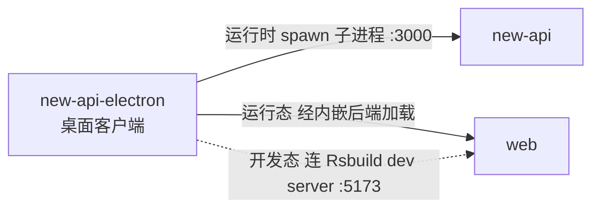

# new-api-electron 的组件关系

## 本组件为中心关系图

## 本组件的交互

| 对方组件 | 时机 | 方向 | 方式 | 说明 |
| --- | --- | --- | --- | --- |
| new-api | 运行时 | 本组件→对方 | 父子进程（spawn） | electron 主进程 spawn 内嵌的 new-api 二进制为子进程，固定 `PORT=3000`，数据目录指向 `userData/data`，`before-quit` 时 SIGTERM 子进程（5s 后 SIGKILL 兜底） |
| web | 运行时 | 本组件→对方 | 经内嵌后端加载 | 桌面运行态 BrowserWindow 加载 `http://127.0.0.1:3000`，即由内嵌的 new-api 提供 web 前端（与 web 经 new-api 间接交互） |
| web | 开发态 | 本组件→对方 | Rsbuild dev server | 开发模式（`NODE_ENV=development`）下本组件不启动后端二进制，改为加载 Rsbuild dev server（:5173），由 dev server 代理 `/api`、`/mj`、`/pg` 到开发者本机的 `go run main.go`（:3000） |
