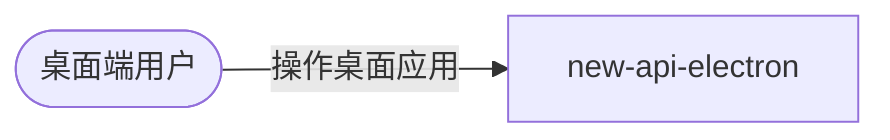

# new-api-electron 的入站·外部关系

### 外部角色

| 对方角色 | 方式 | 说明 |
| --- | --- | --- |
| 桌面端用户 | 桌面 GUI 操作 | 通过桌面窗口操作 new-api 的功能（实际由内嵌 new-api 后端承载）；关窗最小化到系统托盘 |

### 外部系统

new-api-electron 不直接对接任何外部系统（均经内嵌 new-api 间接），本表为空。
