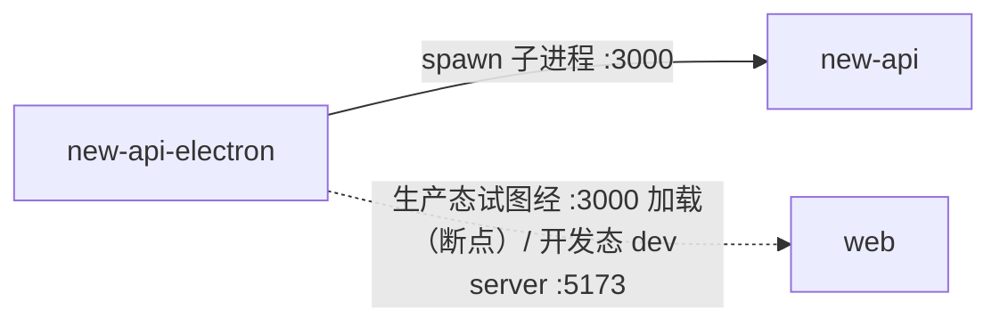

# new-api-electron 的出站·内部关系

| 对方组件 | 方式 | 说明 |
| --- | --- | --- |
| new-api | 父子进程（spawn） | 主进程 spawn 内嵌 Go 二进制为子进程，固定 `PORT=3000`，数据目录指向 `userData/data`，`before-quit` 时 SIGTERM 子进程（5s 后 SIGKILL 兜底） |
| web | 经后端间接加载（运行态，**已知断点**）/ dev server（开发态） | 运行态 BrowserWindow 加载 `http://127.0.0.1:3000`，但后端已不内嵌前端 → 当前生产构建显示 JSON 404 / 空白页（架构断点，前端页面不可用）。开发态（`NODE_ENV=development`）不启动后端二进制，改为加载 Rsbuild dev server（:5173），由 dev server 代理到本机 new-api（:3000），前端正常 |

> 运行态的 web 加载关系当前失效，因 new-api 不再托管前端静态站点。恢复需让桌面态独立托管 `web/dist` 前端产物。
