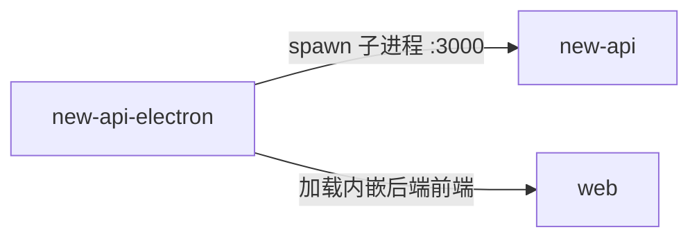

# new-api-electron 的出站·内部关系

| 对方组件 | 方式 | 说明 |
| --- | --- | --- |
| new-api | 父子进程（spawn） | 主进程 spawn 内嵌 Go 二进制为子进程，固定 `PORT=3000`，数据目录指向 `userData/data`，`before-quit` 时 SIGTERM 子进程（5s 后 SIGKILL 兜底） |
| web | 经内嵌后端加载（运行态）/ dev server（开发态） | 运行态 BrowserWindow 加载 `http://127.0.0.1:3000`，由内嵌 new-api 提供 web 前端（与 web 经 new-api 间接交互）；开发态（`NODE_ENV=development`）不启动后端二进制，改为加载 Rsbuild dev server（:5173），由 dev server 代理到本机 `go run main.go`（:3000） |
