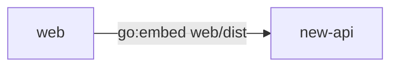

# new-api 的编译时关系

```mermaid
graph LR
  Me[new-api]
  Web[web]

  Web -- "go:embed web/dist" --> Me
```

| 对方组件 | 方向 | 机制 | 说明 |
| --- | --- | --- | --- |
| web | 对方嵌入本组件 | `go:embed` | new-api 构建时通过 `//go:embed web/dist` 把 web 的静态站点产物嵌入二进制，产出单体可执行文件 |
