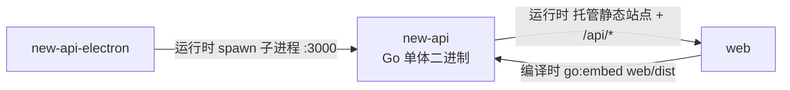
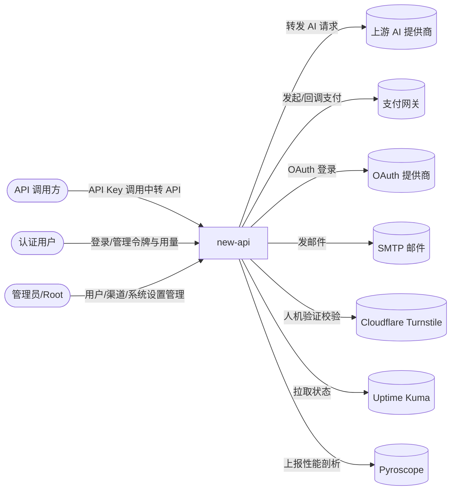
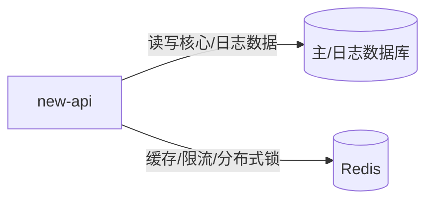

# new-api 的组件关系

## 与其他组件的关系

| 对方组件 | 时机 | 方向 | 方式 | 说明 |
| --- | --- | --- | --- | --- |
| web | 编译时 | 对方→本组件 | `go:embed` 内嵌 | new-api 在构建时通过 `//go:embed web/dist` 把 web 的静态站点产物嵌入二进制，产出单体可执行文件 |
| web | 运行时 | 本组件→对方 | 同源 HTTP 托管 | new-api 在 :3000 同源托管 web 的静态站点，并向其提供 `/api/*`、`/mj/*`、`/pg/*` 等后端接口 |
| new-api-electron | 运行时 | 对方→本组件 | 父子进程（spawn） | electron 主进程 spawn 内嵌的 new-api 二进制为子进程，固定 `PORT=3000`，数据目录指向 `userData/data`，退出时由 electron 发 SIGTERM 优雅终止 |

## 与外部的关系

### 外部角色

| 对方角色 | 方向 | 方式 | 说明 |
| --- | --- | --- | --- |
| API 调用方 | 对方→本组件 | HTTP（`sk-` API Key 鉴权） | 调用 AI 中转 API（`/v1/*`、`/v1/messages`、`/v1beta/*`、`/mj/*`、`/suno/*`、`/v1/realtime` 等）；与用户角色体系正交 |
| 认证用户 | 对方→本组件 | HTTP（Session/JWT） | 经 web 前端调用 Dashboard API（`/api/*`）管理自己的令牌、用量、订阅、配额、钱包 |
| 管理员/Root | 对方→本组件 | HTTP（Session/JWT + AdminAuth/RootAuth） | 经 web 前端调用管理类 API（用户/渠道/兑换码/系统设置等） |

### 上游服务

| 对方系统 | 方向 | 方式 | 说明 |
| --- | --- | --- | --- |
| 上游 AI 提供商（OpenAI/Claude/Gemini/AWS Bedrock/阿里/百度/智谱 等 40+ 家） | 本组件→对方 | HTTP/WebSocket | 按渠道配置转发对话/嵌入/图像/音频/异步任务请求并聚合响应；按渠道动态配置 |
| 支付网关（Stripe、EPay 易支付、Creem、Waffo/Waffo Pancake） | 双向 | HTTP + webhook 回调 | 本组件发起充值/订阅支付订单，并接收其异步 webhook 确认支付 |
| OAuth 提供商（GitHub、Discord、LinuxDo、OIDC、微信、Telegram、自定义 OAuth2） | 双向 | HTTP（OAuth 流程） | 本组件作为 OAuth 客户端完成第三方登录与账号绑定 |
| OpenAI Codex OAuth（auth.openai.com） | 本组件→对方 | HTTP（OAuth） | 通过 OAuth 刷新 Codex 凭证以支撑 Codex 风格中转 |
| SMTP 邮件服务 | 本组件→对方 | SMTP/SSL/STARTTLS | 发送验证与通知邮件（含 NTLM/Outlook 鉴权） |
| Cloudflare Turnstile | 本组件→对方 | HTTP | 登录/注册等敏感接口的人机验证校验 |
| Uptime Kuma | 本组件→对方 | HTTP | 拉取其状态页数据在仪表盘展示 |
| Grafana Pyroscope | 本组件→对方 | HTTP | 上报 CPU/内存/Mutex/Block 持续性能剖析 |

## 依赖的基础设施

> 以下为承载本组件运行的支撑设施（数据库、缓存等），属"系统如何落地"的内部决策，不属对外的业务关系，单列一节。

| 基础设施 | 方向 | 方式 | 说明 |
| --- | --- | --- | --- |
| 主数据库（MySQL/PostgreSQL/SQLite） | 双向 | SQL（GORM） | 持久化用户、渠道、令牌、订单等核心数据 |
| 日志数据库（MySQL/PostgreSQL/ClickHouse） | 双向 | SQL（GORM） | 存储用量日志；可选，默认复用主库 |
| Redis | 双向 | RESP | 多节点缓存同步、分布式限流、分布式锁、令牌缓存、配额原子计数 |
