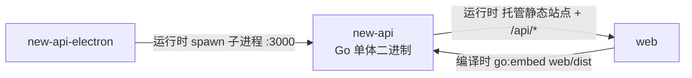

# new-api 的组件关系

## 本组件为中心关系图

## 本组件的交互

| 对方组件 | 时机 | 方向 | 方式 | 说明 |
| --- | --- | --- | --- | --- |
| web | 编译时 | 对方→本组件 | `go:embed` 内嵌 | new-api 在构建时通过 `//go:embed web/dist` 把 web 的静态站点产物嵌入二进制，产出单体可执行文件 |
| web | 运行时 | 本组件→对方 | 同源 HTTP 托管 | new-api 在 :3000 同源托管 web 的静态站点，并向其提供 `/api/*`、`/mj/*`、`/pg/*` 等后端接口 |
| new-api-electron | 运行时 | 对方→本组件 | 父子进程（spawn） | electron 主进程 spawn 内嵌的 new-api 二进制为子进程，固定 `PORT=3000`，数据目录指向 `userData/data`，退出时由 electron 发 SIGTERM 优雅终止 |
