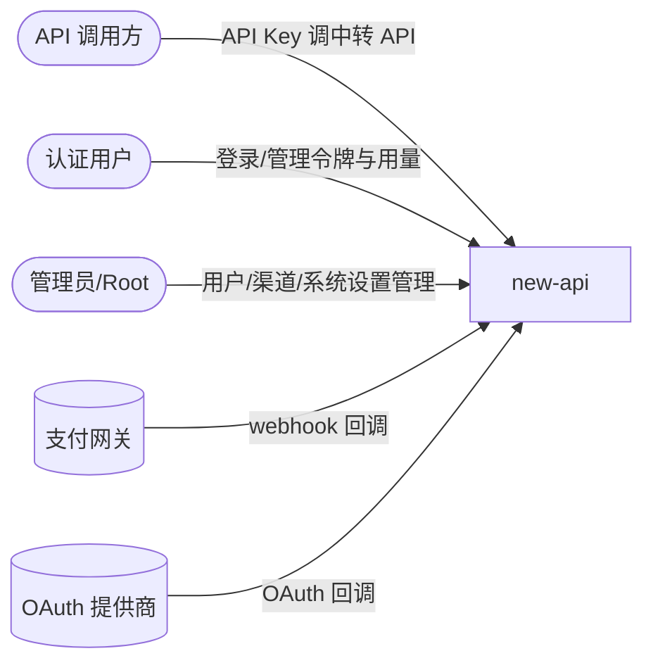

# new-api 的入站·外部关系

### 外部角色

| 对方角色 | 方式 | 说明 |
| --- | --- | --- |
| API 调用方 | HTTP（`sk-` API Key 鉴权） | 调用 AI 中转 API（`/v1/*`、`/v1/messages`、`/v1beta/*`、`/mj/*`、`/suno/*`、`/v1/realtime` 等）；与用户角色体系正交 |
| 认证用户 | HTTP（Session/JWT） | 经 web 前端调用 Dashboard API（`/api/*`）管理自己的令牌、用量、订阅、配额、钱包 |
| 管理员/Root | HTTP（Session/JWT + AdminAuth/RootAuth） | 经 web 前端调用管理类 API（用户/渠道/兑换码/系统设置等） |

### 外部系统

| 对方系统 | 方式 | 说明 |
| --- | --- | --- |
| 支付网关（Stripe、EPay、Creem、Waffo） | HTTP webhook 回调 | 支付完成后接收异步 webhook 确认支付结果 |
| OAuth 提供商（GitHub、Discord、LinuxDo、OIDC、微信、Telegram） | HTTP OAuth 回调 | 第三方登录授权完成后接收回调完成登录/绑定 |
