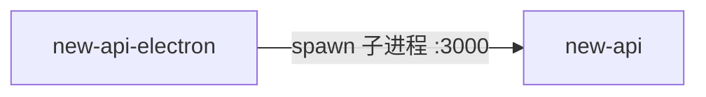

# new-api 的入站·内部关系

| 对方组件 | 方式 | 说明 |
| --- | --- | --- |
| new-api-electron | 父子进程（spawn） | electron 主进程 spawn 内嵌的 new-api 二进制为子进程，固定 `PORT=3000`，数据目录指向 `userData/data`；退出时由 electron 发 SIGTERM 优雅终止（5s 后 SIGKILL 兜底） |
