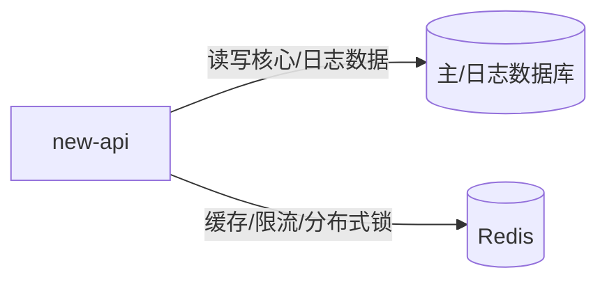

# new-api 的基础设施依赖

| 基础设施 | 方向 | 方式 | 说明 |
| --- | --- | --- | --- |
| 主数据库（MySQL/PostgreSQL/SQLite） | 双向 | SQL（GORM） | 持久化用户、渠道、令牌、订单等核心数据 |
| 日志数据库（MySQL/PostgreSQL/ClickHouse） | 双向 | SQL（GORM） | 存储用量日志；可选，默认复用主库 |
| Redis | 双向 | RESP | 多节点缓存同步、分布式限流、分布式锁、令牌缓存、配额原子计数 |
