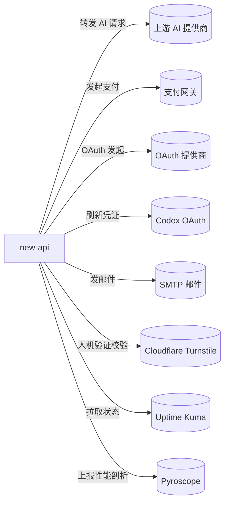

# new-api 的出站·外部关系

| 对方系统 | 方式 | 说明 |
| --- | --- | --- |
| 上游 AI 提供商（OpenAI/Claude/Gemini/AWS Bedrock/阿里/百度/智谱 等 40+ 家） | HTTP/WebSocket | 按渠道配置转发对话/嵌入/图像/音频/异步任务请求并聚合响应；按渠道动态配置 |
| 支付网关（Stripe、EPay 易支付、Creem、Waffo/Waffo Pancake） | HTTP | 发起充值/订阅支付订单 |
| OAuth 提供商（GitHub、Discord、LinuxDo、OIDC、微信、Telegram、自定义 OAuth2） | HTTP（OAuth 流程） | 作为 OAuth 客户端发起第三方登录与账号绑定 |
| OpenAI Codex OAuth（auth.openai.com） | HTTP（OAuth） | 通过 OAuth 刷新 Codex 凭证以支撑 Codex 风格中转 |
| SMTP 邮件服务 | SMTP/SSL/STARTTLS | 发送验证与通知邮件（含 NTLM/Outlook 鉴权） |
| Cloudflare Turnstile | HTTP | 登录/注册等敏感接口的人机验证校验 |
| Uptime Kuma | HTTP | 拉取其状态页数据在仪表盘展示 |
| Grafana Pyroscope | HTTP | 上报 CPU/内存/Mutex/Block 持续性能剖析 |
