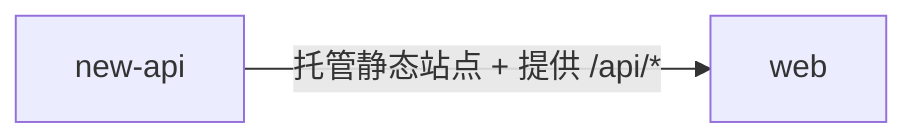

# new-api 的出站·内部关系

```mermaid
graph LR
  Me[new-api]
  Web[web]

  Me -- "托管静态站点 + 提供 /api/*" --> Web
```

| 对方组件 | 方式 | 说明 |
| --- | --- | --- |
| web | 同源 HTTP 托管 | new-api 在 :3000 同源托管 web 的静态站点，并向其提供 `/api/*`、`/mj/*`、`/pg/*` 等后端接口 |
