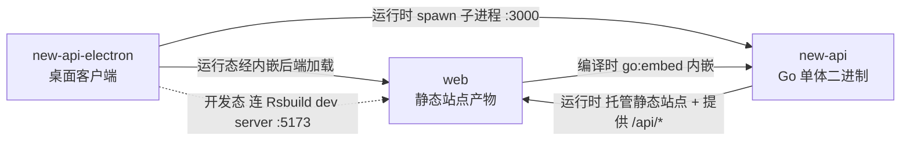

# 组件关系

## 组件关系图

## 组件间交互

| 组件 A | 组件 B | 时机 | 方式 | 说明 |
| --- | --- | --- | --- | --- |
| web | new-api | 编译时 | `go:embed` 内嵌 | new-api 在构建时通过 `//go:embed web/dist` 把 web 的静态站点产物嵌入二进制，产出单体可执行文件 |
| new-api | web | 运行时 | 同源 HTTP 托管 | new-api 在 :3000 同源托管 web 的静态站点，并向其提供 `/api/*`、`/mj/*`、`/pg/*` 等后端接口 |
| new-api-electron | new-api | 运行时 | 父子进程（spawn） | electron 主进程 spawn 内嵌的 new-api 二进制为子进程，固定 `PORT=3000`，数据目录指向 `userData/data`，退出时 SIGTERM 优雅终止 |
| new-api-electron | web | 运行时 | 经内嵌后端加载 | 桌面运行态 BrowserWindow 加载 `http://127.0.0.1:3000`，即由内嵌的 new-api 提供 web 前端 |
| new-api-electron | web | 开发态 | Rsbuild dev server | 开发模式（`NODE_ENV=development`）下 electron 不启动后端二进制，改为加载 Rsbuild dev server（:5173），由 dev server 代理 `/api`、`/mj`、`/pg` 到开发者本机的 `go run main.go`（:3000） |
