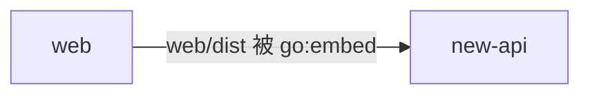

# web 的编译时关系

```mermaid
graph LR
  Me[web]
  Api[new-api]

  Me -- "web/dist 被 go:embed" --> Api
```

| 对方组件 | 方向 | 机制 | 说明 |
| --- | --- | --- | --- |
| new-api | 本组件嵌入对方 | `go:embed` | web 的构建产物 `web/dist` 在 new-api 构建时通过 `//go:embed web/dist` 被嵌入二进制 |
