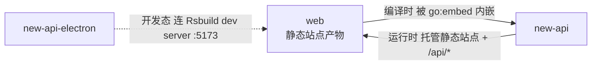
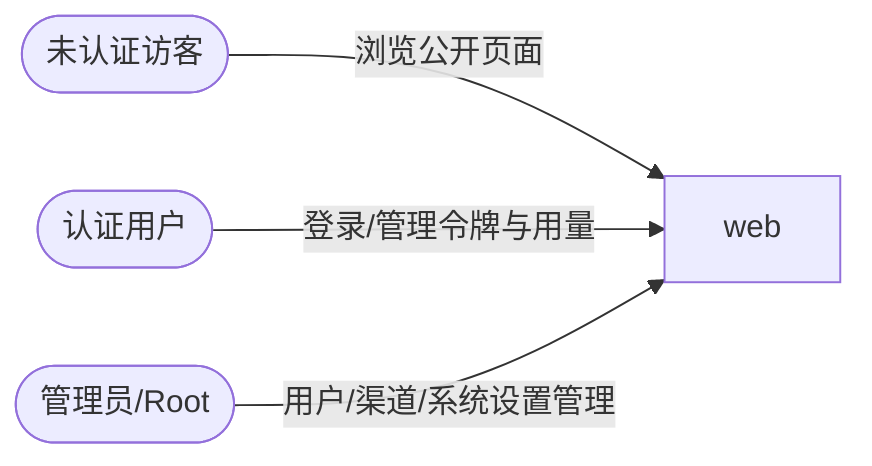

# web 的组件关系

## 与其他组件的关系

| 对方组件 | 时机 | 方向 | 方式 | 说明 |
| --- | --- | --- | --- | --- |
| new-api | 编译时 | 本组件→对方 | `go:embed` 内嵌 | web 的构建产物 `web/dist` 在 new-api 构建时通过 `//go:embed web/dist` 被嵌入二进制 |
| new-api | 运行时 | 对方→本组件 | 同源 HTTP 托管 | new-api 在 :3000 同源托管 web 的静态站点，并向其提供 `/api/*`、`/mj/*`、`/pg/*` 等后端接口 |
| new-api-electron | 运行时 | 对方→本组件 | 经内嵌后端加载 | 桌面运行态 BrowserWindow 加载 `http://127.0.0.1:3000`，由内嵌的 new-api 提供 web 前端（与 web 无直接交互，经 new-api 间接） |
| new-api-electron | 开发态 | 对方→本组件 | Rsbuild dev server | 开发模式（`NODE_ENV=development`）下 electron 加载 Rsbuild dev server（:5173），由 dev server 代理 `/api`、`/mj`、`/pg` 到本机 `go run main.go`（:3000） |

## 与外部的关系

> web 不直接对接任何外部系统——所有外部系统（上游 AI、支付、OAuth、SMTP 等）均经 new-api 间接交互。因此本节只列外部角色。

### 外部角色

| 对方角色 | 方向 | 方式 | 说明 |
| --- | --- | --- | --- |
| 未认证访客 | 对方→本组件 | 浏览器 HTTP | 访问公开页面与入口（定价、公告、系统状态、注册/登录），无需登录 |
| 认证用户 | 对方→本组件 | 浏览器 HTTP | 登录后管理自己的 API 令牌、用量日志、订阅、配额与钱包 |
| 管理员/Root | 对方→本组件 | 浏览器 HTTP | 经管理界面管理用户、渠道、兑换码、系统设置等 |

### 上游服务

web 不直接对接任何上游服务（均经 new-api 间接），本表为空。

## 依赖的基础设施

web 不直接连接任何基础设施（数据库/缓存均经 new-api 间接），本节为空。
