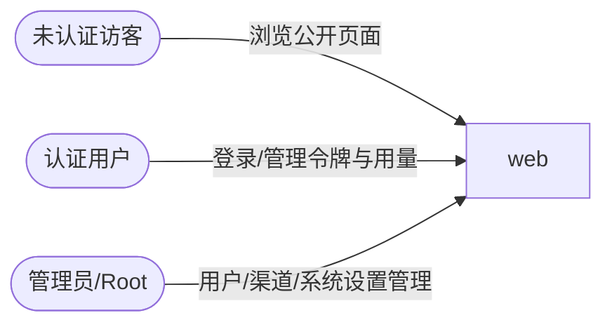

# web 的入站·外部关系

### 外部角色

| 对方角色 | 方式 | 说明 |
| --- | --- | --- |
| 未认证访客 | 浏览器 HTTP | 访问公开页面与入口（定价、公告、系统状态、注册/登录），无需登录 |
| 认证用户 | 浏览器 HTTP | 登录后管理自己的 API 令牌、用量日志、订阅、配额与钱包 |
| 管理员/Root | 浏览器 HTTP | 经管理界面管理用户、渠道、兑换码、系统设置等 |

### 外部系统

web 不直接对接任何外部系统（均经 new-api 间接），本表为空。
