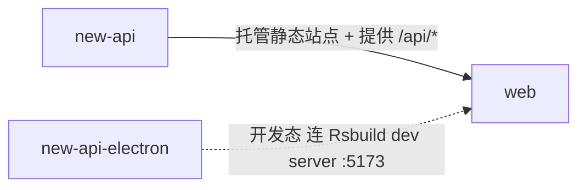

# web 的入站·内部关系

| 对方组件 | 方式 | 说明 |
| --- | --- | --- |
| new-api | 同源 HTTP 托管 | new-api 在 :3000 同源托管 web 的静态站点，并向其提供 `/api/*`、`/mj/*`、`/pg/*` 等后端接口 |
| new-api-electron | Rsbuild dev server（开发态） | 开发模式（`NODE_ENV=development`）下 electron 加载 Rsbuild dev server（:5173），由 dev server 代理 `/api`、`/mj`、`/pg` 到本机 `go run main.go`（:3000）。运行态 electron 经内嵌 new-api 间接加载 web，与本组件无直接交互。 |
