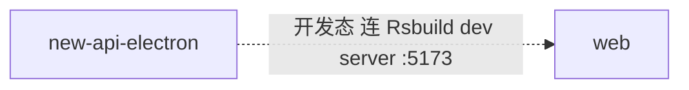

# web 的入站·内部关系

| 对方组件 | 方式 | 说明 |
| --- | --- | --- |
| new-api-electron | Rsbuild dev server（开发态） | 开发模式（`NODE_ENV=development`）下 electron 加载 Rsbuild dev server（:5173），由 dev server 代理 `/api`、`/mj`、`/pg` 到本机 new-api（:3000）。运行态 electron 经 :3000 试图加载前端，但后端已不内嵌前端（见已知断点），与本组件无直接交互 |

> web 的静态站点不再由 new-api 同源托管（前后端分离）。生产环境下本组件由独立静态主机（nginx/CDN）托管，new-api 不再 inbound 到本组件。
