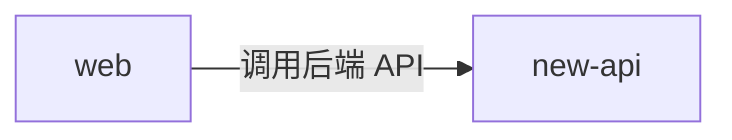

# web 的出站·内部关系

| 对方组件 | 方式 | 说明 |
| --- | --- | --- |
| new-api | HTTP（浏览器端调用后端 API） | web 作为浏览器端 SPA 运行时，主动向 new-api 发起请求调用后端接口（`/api/*`、`/mj/*`、`/pg/*` 等）。生产构建为同源假设（`baseURL=''`），形态一/二天然同源（:3000）；形态三独立托管时经反向代理把 `/api`、`/mj`、`/pg` 转发回 new-api；开发态由 Rsbuild dev server 代理到本机 `go run main.go`（:3000）。 |

> 与 inbound-internal 的"new-api 托管 web 静态站点"是方向相反的两条独立关系：后者是后端向前端**下发静态资源**，本条是前端在浏览器运行后**调用后端 API**。两者共同构成前后端双向交互。
