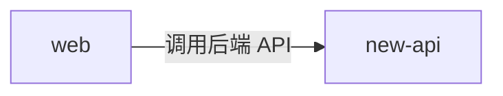

# web 的出站·内部关系

| 对方组件 | 方式 | 说明 |
| --- | --- | --- |
| new-api | HTTP（浏览器端调用后端 API） | web 作为浏览器端 SPA 运行时，主动向 new-api 发起请求调用后端接口（`/api/*`、`/mj/*`、`/pg/*` 等）。生产构建为同源假设（`baseURL=''`），独立托管时经反向代理把 `/api`、`/mj`、`/pg` 转发回 new-api :3000；开发态由 Rsbuild dev server 代理到本机 new-api（:3000） |

> 本组件不再被 new-api 内嵌托管。前端与后端的交互完全发生在浏览器运行时（经反向代理回源），new-api 不向前端下发静态资源。
