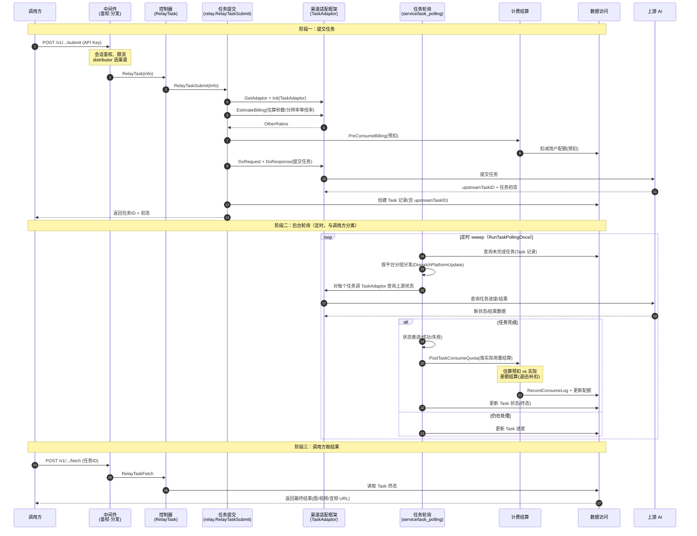

# 异步任务流程（图像 / 视频 / 音频生成）

> 调用方发起异步生成任务（Suno 音乐、Midjourney 图像、Kling/Sora/Vidu 视频等），new-api 提交任务给上游、返回任务 ID，随后**后台轮询**推进任务状态，完成后结算计费。与同步中继的根本区别：上游不立即返回结果，需要异步轮询。

## 时序图

## 流程说明

**阶段一：提交任务**
1. 请求经鉴权/限流/distributor 选渠道后，到控制器 `RelayTask`（`controller/relay.go`），转交 `relay.RelayTaskSubmit`（`relay/relay_task.go:145`）。
2. `EstimateBilling`（191 行）：TaskAdaptor 从请求中抽取计费因子（视频秒数、分辨率等）返回 OtherRatios 倍率。
3. `PreConsumeBilling`（208 行）：按估算预扣配额（防超用，首次提交必扣）。
4. `DoRequest` + `DoResponse`：向上游提交任务，拿到 `upstreamTaskID` 与任务初态。
5. 创建 Task 记录（数据访问），返回任务 ID 给调用方。

**阶段二：后台轮询**（`service/task_polling.go`，与调用方分离）
6. `RunTaskPollingOnce`（108 行）定时 sweep 未完成的任务，`DispatchPlatformUpdate`（179 行）按平台（Suno/Midjourney/视频）分组分发。
7. 对每个任务调 TaskAdaptor 查询上游状态；若完成，状态推进到终态，调 `PostTaskConsumeQuota` 按实际用量结算（预扣 vs 实际差额），写日志、更新配额。
8. `sweepTimedOutTasks`（44 行）清理超时任务。

**阶段三：取结果**
9. 调用方用任务 ID 调 `RelayTaskFetch`，读 Task 终态返回最终结果。

## 涉及的 L3 逻辑模块

| 阶段 | 逻辑模块 | 模块文件 |
| --- | --- | --- |
| 鉴权/选渠道 | 会话与令牌鉴权、中间件、渠道选择 | [auth/session-auth.md](../modules/auth/session-auth.md)、[api/middleware.md](../modules/api/middleware.md)、[service/channel-select.md](../modules/service/channel-select.md) |
| 任务提交/轮询编排 | 任务轮询与异步处理（含 RelayTaskSubmit） | [service/task-polling.md](../modules/service/task-polling.md) |
| 上游交互 | 渠道适配框架（TaskAdaptor） | [relay/relay-adaptor.md](../modules/relay/relay-adaptor.md) |
| 计费 | 计费结算、计费表达式引擎 | [service/billing.md](../modules/service/billing.md)、[pkg/billing-expr.md](../modules/pkg/billing-expr.md) |
| 任务记录/配额 | 实体数据访问 | [data/data-access.md](../modules/data/data-access.md) |
| 全程状态 | 中继上下文（TaskRelayInfo） | [relay/relay-context.md](../modules/relay/relay-context.md) |

## 项目约束（计费相关）

- `EstimateBilling` 返回的 OtherRatios 是用户可控的计费乘数（秒数/分辨率），必须经 `PriceData.AddOtherRatio`（拒绝非正/NaN/Inf），不得直接写。
- 任务时长来自上游 deduction 或文件头，需饱和转换，防溢出产生负扣费。
