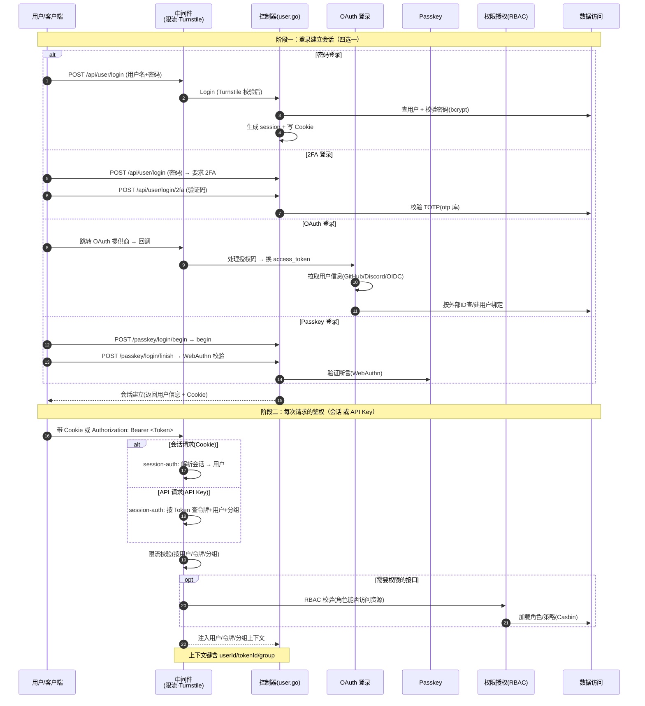

# 用户登录与鉴权流程

> 用户登录（密码 / OAuth / Passkey / 2FA）建立会话，以及后续每个 API 请求的鉴权链路。区分"登录时建立身份"与"每次请求校验身份"两个阶段。

## 时序图

## 流程说明

**阶段一：登录建立会话**（四选一，入口都在 `server/internal/controller/user.go` + `server/internal/router/api-router.go`）
1. **密码登录**：`Login`（user.go:40）→ 查用户 + bcrypt 校验密码 → 生成 session。前置 Turnstile 人机验证 + 关键限流。
2. **2FA**：密码校验通过后若启用 2FA，要求二次提交 TOTP 验证码（`Verify2FALogin`，pquerna/otp）。
3. **OAuth**：跳转外部提供商（GitHub/Discord/LinuxDo/OIDC/自定义）→ 回调处理授权码 → 换 token → 拉用户信息 → 按外部 ID 查/建绑定（server/internal/oauth 模块）。
4. **Passkey**：两步——`PasskeyLoginBegin` 发起挑战 + `PasskeyLoginFinish` 用 WebAuthn 验证断言（service/passkey）。

**阶段二：每次请求的鉴权**（中间件链）
5. `session-auth`（`server/internal/middleware/auth.go`）：解析身份——Cookie 会话 或 API Key（Token）。Token 鉴权查令牌+用户+分组注入上下文。
6. 限流校验（按用户/令牌/分组配额）。
7. 需要权限的接口经 `authz`（service/authz，Casbin RBAC）校验角色能否访问资源。
8. 注入上下文键（userId/tokenId/group 等），供后续中间件与控制器使用。

**阶段三：账户绑定/解绑**（已登录用户关联第三方账号）
9. 已登录用户可绑定/解绑第三方登录方式：自定义 OAuth Provider（`BindCustomOAuth`/`UnbindCustomOAuth`）、Telegram（`TelegramBind`）、邮箱（`EmailBind`）、微信（`WeChatBind`）。绑定后该第三方即可用于登录。
10. 管理员可代用户解绑（`UnbindCustomOAuthByAdmin`、`AdminClearUserBinding`）。绑定的 OAuth 提供者本身是独立 CRUD（`CreateCustomOAuthProvider` 等）。

## 涉及的 L3 逻辑模块

| 阶段 | 逻辑模块 | 模块文件 |
| --- | --- | --- |
| 密码/2FA 登录 | 控制器、会话与令牌鉴权 | [api/controller.md](../modules/api/controller.md)、[auth/session-auth.md](../modules/auth/session-auth.md) |
| OAuth 登录 | OAuth 登录 | [auth/oauth.md](../modules/auth/oauth.md) |
| Passkey 登录 | Passkey 与无密码认证 | [auth/passkey.md](../modules/auth/passkey.md) |
| 每次请求鉴权 | 会话与令牌鉴权、中间件 | [auth/session-auth.md](../modules/auth/session-auth.md)、[api/middleware.md](../modules/api/middleware.md) |
| 权限校验 | 权限授权(RBAC) | [auth/authz.md](../modules/auth/authz.md) |
| 用户/令牌数据 | 实体数据访问 | [data/data-access.md](../modules/data/data-access.md) |
