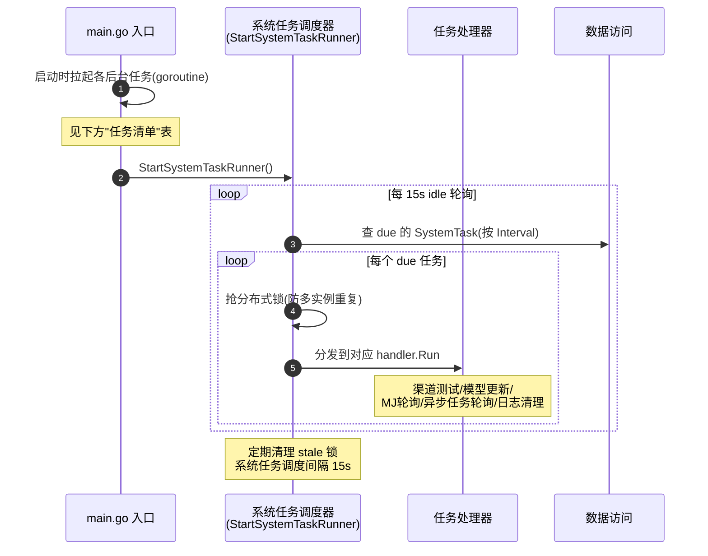

# 后台自动维护任务总览

> new-api 在 `server/cmd/new-api/main.go` 启动时拉起一批**系统级后台任务**（无 HTTP 入口，自动周期运行）。它们承载请求驱动流程覆盖不到的系统维护职责：周期任务调度、配额聚合、凭证刷新、鉴权产物清理、缓存/策略同步等。本文是这一整类的总览。

## 时序图（启动与调度）

## 任务清单（`server/cmd/new-api/main.go` 启动的后台任务）

| 任务 | 启动入口 | 职责 | 协作模块 |
| --- | --- | --- | --- |
| **系统任务调度器** | `service.StartSystemTaskRunner` | 通用周期任务调度框架，注册并调度下列处理器 | service/system_task |
| ├ 渠道测试 | handler: `channelTestHandler` | 周期性测试渠道可用性（探活） | 渠道适配框架、渠道选择 |
| ├ 模型更新 | handler: `modelUpdateHandler` | 周期性更新上游模型 | 上游同步、配置 |
| ├ Midjourney 轮询 | handler: `midjourneyPollHandler`（15s） | 轮询 MJ 任务状态 | 任务轮询、渠道适配框架 |
| ├ 异步任务轮询 | handler: `asyncTaskPollHandler`（15s） | 轮询视频/音频等异步任务 | 任务轮询（见 async-task.md） |
| └ 日志清理 | handler: `logCleanupHandler` | 清理过期日志 | 数据访问 |
| 订阅配额重置 | `service.StartSubscriptionQuotaResetTask` | 周期到期订阅过期+重发配额 | 见 subscription.md |
| Codex 凭证刷新 | `service.StartCodexCredentialAutoRefreshTask` | 自动刷新 Codex 渠道凭证 | HTTP 客户端、数据访问 |
| 配额数据聚合 | `model.UpdateQuotaData` | 聚合统计用户/全局配额用量数据（非实时） | 数据访问 |
| authz 策略同步 | `authz.StartPolicySync` | 定期同步 Casbin 权限策略 | 权限授权(RBAC)、数据访问 |
| auth 产物清理 | `service.StartAuthArtifactCleanup` | 清理过期会话/Passkey 挑战等 | 鉴权、数据访问 |
| 渠道自动更新 | `controller.AutomaticallyUpdateChannels` | 按频率自动更新渠道 | 渠道管理 |
| 系统实例上报 | `service.StartSystemInstanceReporter` | 上报系统实例信息 | HTTP 客户端 |
| 缓存/配置同步 | `model.SyncChannelCache`/`SyncOptions` | 周期同步渠道缓存/系统配置到内存 | 数据访问、配置 |

## 流程说明

1. **启动**：`server/cmd/new-api/main.go` 在服务启动时用 `go xxx()` 拉起各后台任务（goroutine），它们与 HTTP 服务并行运行、整个生命周期常驻。
2. **系统任务调度器**（`server/internal/service/system_task.go`）是核心：它是一个通用框架，`RegisterSystemTaskHandler` 注册处理器（渠道测试/模型更新/MJ 轮询/异步任务轮询/日志清理），`StartSystemTaskRunner` 每 15s 扫描 due 任务，抢分布式锁后分发到对应 handler。多实例部署时靠锁防重复执行。
3. **订阅重置**等独立任务不挂调度器，各自定时循环（见 subscription.md）。
4. **纯监控类**（`common.Monitor`/`StartPyroScope`/`StartSystemMonitor`）是基础设施监控，非业务流程，不在此详述。

## 涉及的 L3 逻辑模块

| 任务类别 | 逻辑模块 | 模块文件 |
| --- | --- | --- |
| 系统任务调度/异步任务 | 任务轮询与异步处理 | [service/task-polling.md](../modules/service/task-polling.md) |
| 渠道测试/更新 | 渠道选择、渠道适配框架 | [service/channel-select.md](../modules/service/channel-select.md)、[relay/relay-adaptor.md](../modules/relay/relay-adaptor.md) |
| authz 同步/auth 清理 | 权限授权(RBAC)、会话与令牌鉴权 | [auth/authz.md](../modules/auth/authz.md)、[auth/session-auth.md](../modules/auth/session-auth.md) |
| 配额聚合/缓存/配置 | 实体数据访问、运行时配置 | [data/data-access.md](../modules/data/data-access.md)、[config/runtime-config.md](../modules/config/runtime-config.md) |
| Codex 凭证/实例上报 | HTTP 客户端与文件处理 | [service/http-file-misc.md](../modules/service/http-file-misc.md) |
