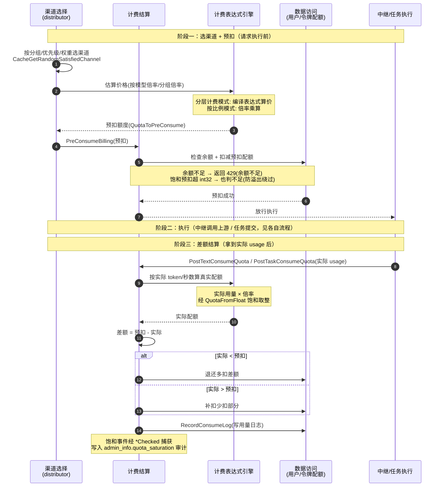

# 计费结算流程（预扣 → 差额结算 → 退还）

> 一次计费请求（同步中继或异步任务）的配额处理全过程：**先预扣防超用，完成后按实际用量差额结算**。这是 new-api 计费安全的核心机制，贯穿中继转发与异步任务两条路径。

## 时序图

## 流程说明

**阶段一：预扣（执行前）**
1. distributor 中间件（`server/internal/middleware/distributor.go:Distribute`）按分组/优先级/权重选渠道（`service.CacheGetRandomSatisfiedChannel`）。
2. 估算价格：按比例模式用模型倍率/分组倍率乘算；分层模式经表达式引擎编译表达式算价。得到预扣额度。
3. `PreConsumeBilling`（`server/internal/controller/relay.go:167` / `server/internal/relay/relay_task.go:208`）：检查余额并扣减预扣配额。**余额不足或饱和预扣超界都判不足**（防溢出绕过），返回 429。预扣成功才放行执行。

**阶段二：执行** — 见同步中继/异步任务流程（调用上游、拿到 usage）。

**阶段三：差额结算（拿到 usage 后）**
4. `PostTextConsumeQuota`（同步）/ `PostTaskConsumeQuota`（任务）：按实际 usage（token/秒数）经表达式引擎或倍率算真实配额。
5. 差额结算：预扣与实际比较，多扣的退还、少扣的补扣。
6. 写 consume 日志（数据访问）。饱和事件经 `*Checked` 变体捕获，审计到日志的 `admin_info.quota_saturation`。

## 涉及的 L3 逻辑模块

| 阶段 | 逻辑模块 | 模块文件 |
| --- | --- | --- |
| 选渠道 | 渠道选择 | [service/channel-select.md](../modules/service/channel-select.md) |
| 估算/结算价格 | 计费表达式引擎 | [pkg/billing-expr.md](../modules/pkg/billing-expr.md) |
| 预扣/差额结算/退还 | 计费结算 | [service/billing.md](../modules/service/billing.md) |
| 配额读写/日志 | 实体数据访问 | [data/data-access.md](../modules/data/data-access.md) |
| 配额饱和换算 | 通用工具（quota_math） | [infra/common-utils.md](../modules/infra/common-utils.md) |

## 项目约束（计费安全铁律）

- **永不产生负扣费**：所有用户可控乘数（image n、video seconds、分辨率）必须先有界校验（400 拒绝）再进计费。
- **配额换算必须用 `server/internal/common/quota_math.go` 的饱和函数**（`QuotaFromFloat`/`QuotaRound`/`QuotaFromDecimal`，int32 上限），禁止裸 `int()` 转换。
- **饱和事件必须审计**：用 `*Checked` 变体捕获 `QuotaClamp`，写日志 `admin_info.quota_saturation` + `LogWarn`。
- **乘数经 `PriceData.AddOtherRatio`**：拒绝非正/NaN/Inf，禁止直接写 OtherRatios。
- 分层计费改动前**必须先读 `server/pkg/billingexpr/expr.md`**。
