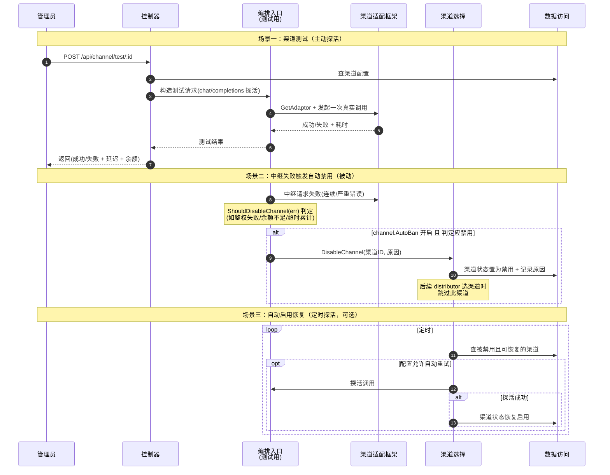

# 渠道管理流程（测试 / 自动禁用 / 自动启用）

> 渠道（Channel，上游 AI 提供商）的生命周期管理。除标准 CRUD 外，两个有跨模块协作的关键能力：**渠道测试**（实际发请求探活）与**自动禁用/启用**（中继失败时自动拉黑、定时探活恢复）。

## 时序图

## 流程说明

**标准 CRUD**：渠道的增删改查（`server/internal/controller/channel.go`），管理员配置渠道（类型/密钥/BaseURL/模型列表/分组等）。CRUD 不涉及跨模块协作。

**场景一：渠道测试**（主动探活）
1. 管理员触发测试，控制器查渠道配置后，构造一次测试请求（`server/internal/controller/channel-test.go`，发 `/v1/chat/completions` 探活），经编排入口 + 适配器发真实调用。
2. 返回成功/失败、延迟、余额（部分渠道支持余额查询，`server/internal/controller/channel-billing.go`）。

**场景二：自动禁用**（被动，中继失败触发）
3. 中继请求失败时（`server/internal/controller/relay.go:367`），`ShouldDisableChannel`（`server/internal/service/channel.go:45`）判定错误是否严重（鉴权失败/余额不足/连续超时等）。
4. 若渠道 `AutoBan` 开启且判定应禁用，`DisableChannel`（`server/internal/service/channel.go:19`）把渠道状态置为禁用 + 记录原因。此后 distributor 选渠道时跳过它。

**场景三：自动启用恢复**（定时探活，可选）
5. 若配置允许，定时对被禁渠道探活，成功则恢复启用。

## 涉及的 L3 逻辑模块

| 场景 | 逻辑模块 | 模块文件 |
| --- | --- | --- |
| CRUD/测试控制器 | 控制器 | [api/controller.md](../modules/api/controller.md) |
| 测试探活调用 | 编排入口、渠道适配框架 | [relay/relay-orchestration.md](../modules/relay/relay-orchestration.md)、[relay/relay-adaptor.md](../modules/relay/relay-adaptor.md) |
| 禁用/启用逻辑 | 渠道选择（含 DisableChannel/ShouldDisableChannel） | [service/channel-select.md](../modules/service/channel-select.md) |
| 渠道状态持久化 | 实体数据访问 | [data/data-access.md](../modules/data/data-access.md) |

## 项目约束

- `ShouldDisableChannel` 的判定逻辑改动需谨慎：误禁用会误伤正常渠道，漏禁用会让故障渠道持续拖慢中继（重试链路）。
- 渠道测试/余额查询若走真实上游，会产生真实计费（`server/internal/controller/channel-test.go` 构造的 `/v1/chat/completions` 路径）。
