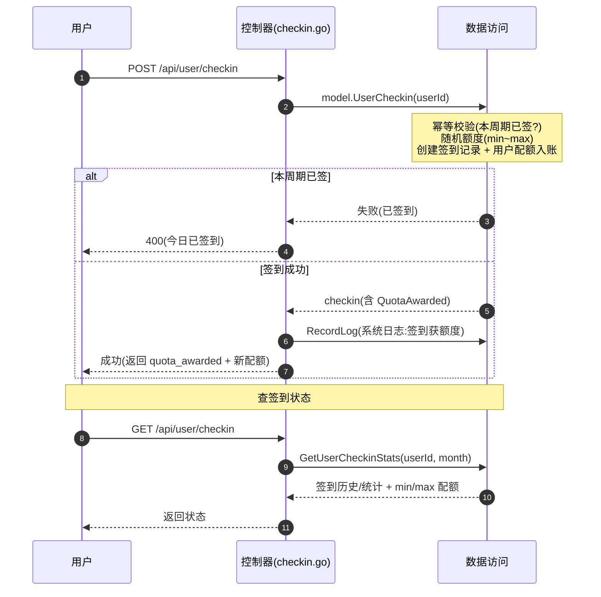

# 用户签到流程

> 用户每日签到获得随机配额奖励（在 min_quota ~ max_quota 区间）。核心约束：**幂等**（同一天/同一周期只能签一次）。

## 时序图

## 流程说明

1. **签到**（`server/internal/controller/checkin.go:DoCheckin`，47 行）：调 `model.UserCheckin`，该函数在数据层完成幂等校验（本周期是否已签）+ 随机额度生成（setting.MinQuota ~ setting.MaxQuota）+ 签到记录创建 + 用户配额入账。
2. 已签则返回 400；成功则写系统日志（`model.RecordLog`，"用户签到，获得额度 X"）。
3. **查状态**（`GetCheckinStatus`）：返回用户当月签到历史/统计 + 可奖励额度区间。

## 涉及的 L3 逻辑模块

| 阶段 | 逻辑模块 | 模块文件 |
| --- | --- | --- |
| 签到控制器 | 控制器 | [api/controller.md](../modules/api/controller.md) |
| 幂等+入账+日志 | 实体数据访问 | [data/data-access.md](../modules/data/data-access.md) |
| 奖励额度区间 | 运行时配置（MinQuota/MaxQuota） | [config/runtime-config.md](../modules/config/runtime-config.md) |
