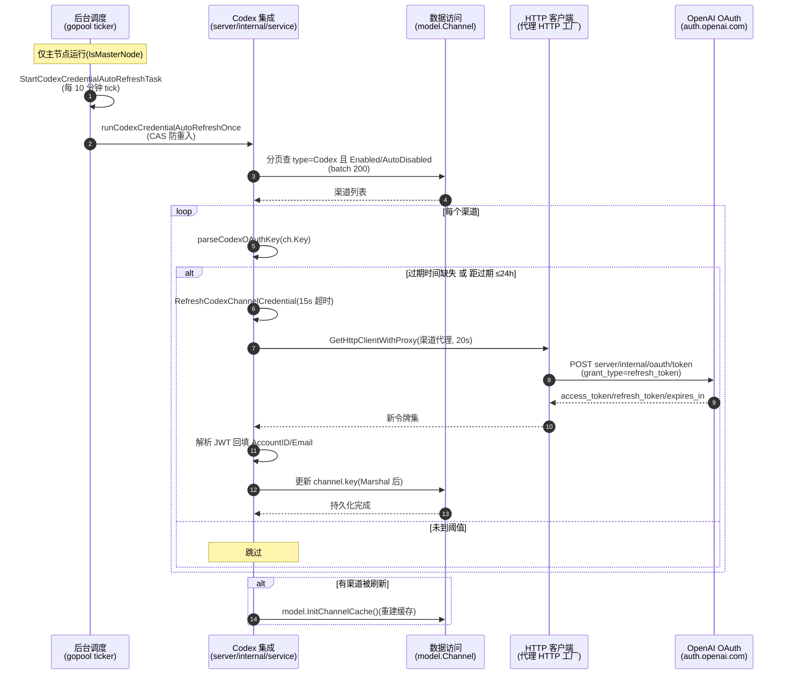

# Codex 渠道凭证自动刷新流程

> 后台定时器（仅主节点）每 10 分钟扫描所有 Codex 渠道，对距 OAuth 令牌过期 ≤24h 的渠道调用 OpenAI OAuth 刷新端点换取新令牌，解析 JWT 回填账号 ID/邮箱，持久化到渠道 `key` 列并重建渠道缓存。跨 Codex 集成、数据访问、HTTP 客户端三模块，含外部 OAuth 系统状态（令牌过期）驱动的阶段流转。

## 时序图

## 流程说明

1. **调度启动 + 主节点门控**（后台调度）：`service.StartCodexCredentialAutoRefreshTask()`（`server/cmd/new-api/main.go:118` 调用）经 `codexCredentialRefreshOnce.Do` 幂等启动；**主节点门控**——`if !common.IsMasterNode { return }`（`server/internal/service/codex_credential_refresh_task.go:37`），非主节点不运行。`gopool.Go` 立即执行一次后每 `codexCredentialRefreshTickInterval = 10 min` tick（line 44-50）。
2. **防重入 + 批量扫描**（Codex 集成 + 数据访问）：`runCodexCredentialAutoRefreshOnce`（line 55）以 `codexCredentialRefreshRunning.CompareAndSwap` 防重入；分页（batch 200）查 `WHERE type=ChannelTypeCodex AND status IN (Enabled, AutoDisabled)`（line 67-80）。
3. **刷新阈值判定**（Codex 集成）：逐渠道 `parseCodexOAuthKey(ch.Key)`（line 104），跳过多 key 渠道（line 95）；**触发条件**（line 116）——`expiredAt` 无法解析，或 `expiredAt - now ≤ 24h`（`codexCredentialRefreshThreshold`）才刷新，否则跳过。
4. **OAuth 刷新**（Codex 集成 + HTTP 客户端 + 外部 OAuth）：`RefreshCodexChannelCredential`（`server/internal/service/codex_credential_refresh.go:42`，15s 超时）调 `RefreshCodexOAuthTokenWithProxy`（`server/internal/service/codex_oauth.go:33`）→ `getCodexOAuthHTTPClient`（按渠道代理，20s 超时）→ POST `https://auth.openai.com/oauth/token`（`grant_type=refresh_token`，`client_id=app_EMoamEEZ73f0CkXaXp7hrann`）；解析返回得新 access/refresh token 与 `expires_in`，算 `ExpiresAt`（line 91）。
5. **JWT 回填 + 持久化**（Codex 集成 + 数据访问）：`ExtractCodexAccountIDFromJWT`/`ExtractEmailFromJWT`（`codex_credential_refresh.go:79/83`）解码 JWT 回填账号身份；`common.Marshal(oauthKey)`（line 89）后 `model.DB.Model(&Channel{}).Where("id=?", ch.Id).Update("key", encoded)`（line 94）持久化到渠道 `key` 列。
6. **缓存重建**（数据访问）：本轮有渠道被刷新则 `model.InitChannelCache()`（line 133-141，带 recover 保护）重建渠道缓存。
7. **错误隔离**：单渠道刷新失败仅 `logger.LogWarn`（task line 124）继续下一渠道，不中止本轮；DB 查询错误才中止本轮（line 82）。

## 涉及的 L3 逻辑模块

| 阶段 | 逻辑模块 | 模块文件 |
| --- | --- | --- |
| 后台调度 + 主节点门控 | 后台自动维护任务 | [background-tasks.md](background-tasks.md) |
| 凭证解析 + 刷新 + JWT 回填 | Codex 集成 | [../modules/service/codex-integration.md](../modules/service/codex-integration.md) |
| 渠道查询/更新/缓存重建 | 实体数据访问 | [../modules/data/data-access.md](../modules/data/data-access.md) |
| 代理 HTTP 客户端 | HTTP 客户端与文件处理 | [../modules/service/http-file-misc.md](../modules/service/http-file-misc.md) |
| JSON 包装（Marshal） | 通用工具 | [../modules/infra/common-utils.md](../modules/infra/common-utils.md) |

## 项目约束

- **JSON 铁律**：`oauthKey` 序列化用 `common.Marshal`（非 `encoding/json`），见 `codex_credential_refresh.go:89`。
