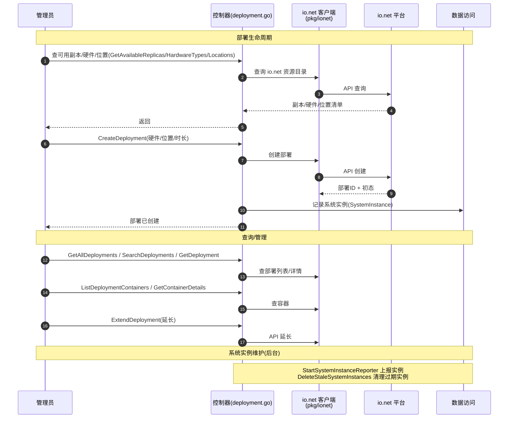

# io.net 部署管理流程

> 管理 io.net（IONET）云上的 GPU 部署实例——创建/查询/延长部署、管理容器、硬件选择、位置选择等。这是一个相对独立的云资源管理业务，经 `pkg/ionet` 客户端与 io.net API 交互。

## 时序图

## 流程说明

1. **资源查询**：查 io.net 的可用副本、硬件类型、位置（经 `pkg/ionet` 客户端转调 io.net API）。
2. **创建部署**：`CreateDeployment`（硬件/位置/时长）→ io.net 创建 → 记录 SystemInstance（数据访问）。
3. **查询/管理**：部署列表/详情/搜索、容器列表/详情、延长部署、更新部署设置/重命名/删除——都经 `pkg/ionet` 转调 io.net API。
4. **系统实例维护**（后台）：`StartSystemInstanceReporter` 上报实例状态、`DeleteStaleSystemInstances` 清理过期实例。

> 另有 VendorMeta（供应商元数据）CRUD，配合上游模型同步使用。

## 涉及的 L3 逻辑模块

| 阶段 | 逻辑模块 | 模块文件 |
| --- | --- | --- |
| 部署控制器 | 控制器 | [api/controller.md](../modules/api/controller.md) |
| io.net 交互 | 多级缓存与可观测与 io.net（ionet 客户端） | [pkg/cachex-perf-ionet.md](../modules/pkg/cachex-perf-ionet.md) |
| 实例记录/清理 | 实体数据访问 | [data/data-access.md](../modules/data/data-access.md) |
| 后台上报 | HTTP 客户端与文件处理（实例上报） | [service/http-file-misc.md](../modules/service/http-file-misc.md) |
