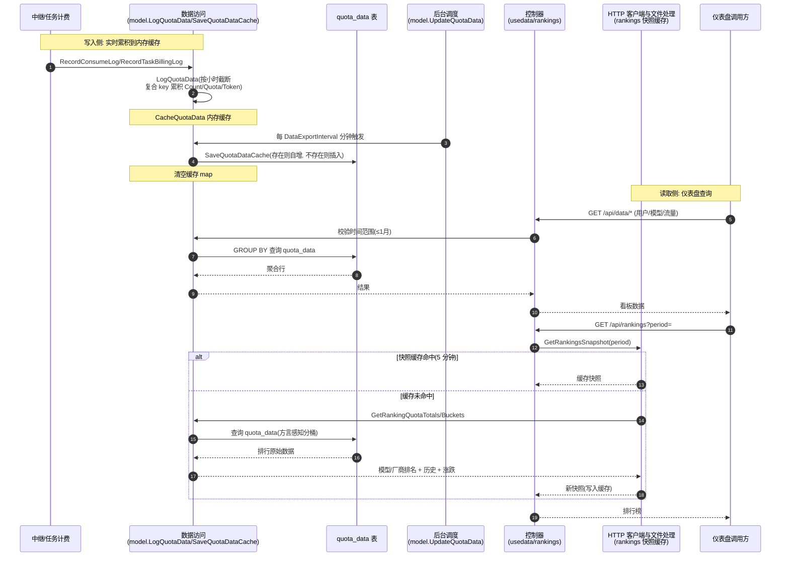

# 配额数据聚合与仪表盘查询流程

> 中继/任务的消费日志在内存按小时×用户×模型×渠道×分组×令牌×节点累积，后台定时器周期性批量落库到 `quota_data` 表；仪表盘与排行榜经控制器查询该表聚合展示。跨数据访问、控制器、HTTP 客户端与文件处理（排行榜快照缓存）三模块，有内存缓存→落库的阶段流转。

## 时序图

## 流程说明

1. **实时累积到内存**（数据访问）：每次 `RecordConsumeLog`（`model/log.go:343`→`LogQuotaData` line 391）或 `RecordTaskBillingLog`（`model/log.go:419`→line 454）计费时，`LogQuotaData`（`model/usedata.go:78`）将 `CreatedAt` 截断到小时，按 `(UserID, Username, ModelName, CreatedAt, UseGroup, TokenID, ChannelID, NodeName)` 复合 key 在 `CacheQuotaData` 内存 map 累积 `Count`/`Quota`/`TokenUsed`（`logQuotaDataCache` line 54）。受 `common.DataExportEnabled` 开关门控。
2. **后台定时落库**（后台调度）：`go model.UpdateQuotaData()`（`main.go:115`）以 `for` 循环每 `common.DataExportInterval` 分钟执行 `SaveQuotaDataCache`（`model/usedata.go:100`）：按复合 key 查 `quota_data` 表，存在则 `increaseQuotaData`（原子 `gorm.Expr("count + ?")`，line 127），不存在则 `Create`（line 120）；落库后清空缓存 map（line 123）。
3. **仪表盘查询**（控制器 + 数据访问）：`controller/usedata.go` 各 handler（`GetAllQuotaDates` line 31、`GetUserQuotaDates` line 63 限 ≤1 月、`GetAllFlowQuotaDates` line 88、`GetUserFlowQuotaDates` line 107）调用 `model.*`（`usedata.go:141/152/163/173`、`usedata_flow.go:25`）对 `quota_data` 表 GROUP BY 查询；流量数据按角色分派（`getRootFlowQuotaData`/`getAdminFlowQuotaData`/`getSelfFlowQuotaData`，`usedata_flow.go:43/57/74`）并回填令牌/渠道名。
4. **排行榜快照**（HTTP 客户端与文件处理 + 数据访问）：`controller/rankings.go:10` → `service.GetRankingsSnapshot(period)`（`service/rankings.go:137`）先查 5 分钟内存缓存（`rankingCacheTTL`）；未命中则 `buildRankingsSnapshot`（line 181）调 `model.GetRankingQuotaTotals`/`GetRankingQuotaBuckets`（`model/usedata_rankings.go:21/34`，方言感知分桶 `rankingBucketExpr` line 51），计算模型/厂商排名、历史序列、涨跌后写缓存。

## 涉及的 L3 逻辑模块

| 阶段 | 逻辑模块 | 模块文件 |
| --- | --- | --- |
| 消费日志写入触发 | 计费结算 | [../modules/service/billing.md](../modules/service/billing.md) |
| 内存累积 + 落库 + 查询 | 实体数据访问 | [../modules/data/data-access.md](../modules/data/data-access.md) |
| 后台定时调度 | 后台自动维护任务 | [../flows/background-tasks.md](background-tasks.md) |
| 仪表盘/排行榜 handler | 控制器 | [../modules/api/controller.md](../modules/api/controller.md) |
| 排行榜快照缓存 | HTTP 客户端与文件处理 | [../modules/service/http-file-misc.md](../modules/service/http-file-misc.md) |
| 开关与周期配置 | 运行时配置 | [../modules/config/runtime-config.md](../modules/config/runtime-config.md) |
