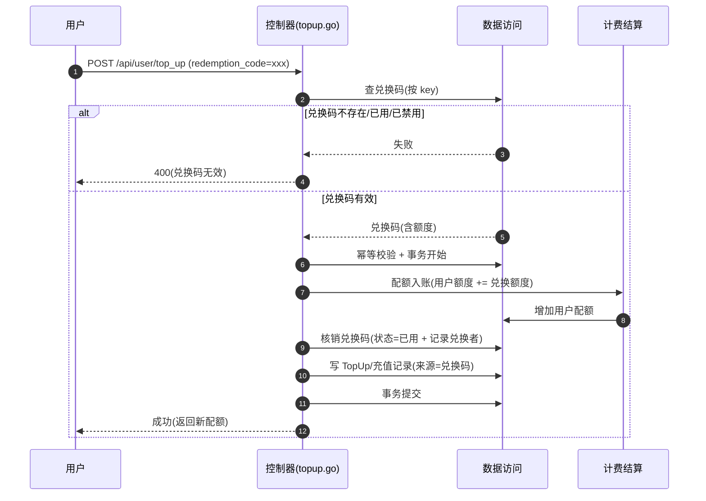

# 兑换码兑换流程

> 用户用兑换码（Redemption Code）兑换配额。区别于充值：无需支付网关，校验兑换码有效后直接给用户入账，并核销兑换码。

## 时序图

## 流程说明

1. 用户在充值入口提交兑换码（走 `/api/user/top_up` 的 redemption 分支，`controller/topup.go`）。
2. 查兑换码：不存在/已用（status=3）/已禁用（status=2）则返回 400。
3. 有效则在事务内：给用户配额入账（兑换码额度）→ 核销兑换码（状态置为已用、记录兑换者）→ 写充值记录（来源标记为兑换码）。
4. 整个兑换在一个事务内，保证配额入账与兑换码核销的原子性。

> 兑换码的生成与管理（`controller/redemption.go`）是管理员 CRUD，不在此流程——此流程只描述用户侧的兑换动作。

## 涉及的 L3 逻辑模块

| 阶段 | 逻辑模块 | 模块文件 |
| --- | --- | --- |
| 兑换入口 | 控制器 | [api/controller.md](../modules/api/controller.md) |
| 配额入账 | 计费结算 | [service/billing.md](../modules/service/billing.md) |
| 兑换码核销/配额/记录 | 实体数据访问 | [data/data-access.md](../modules/data/data-access.md) |
